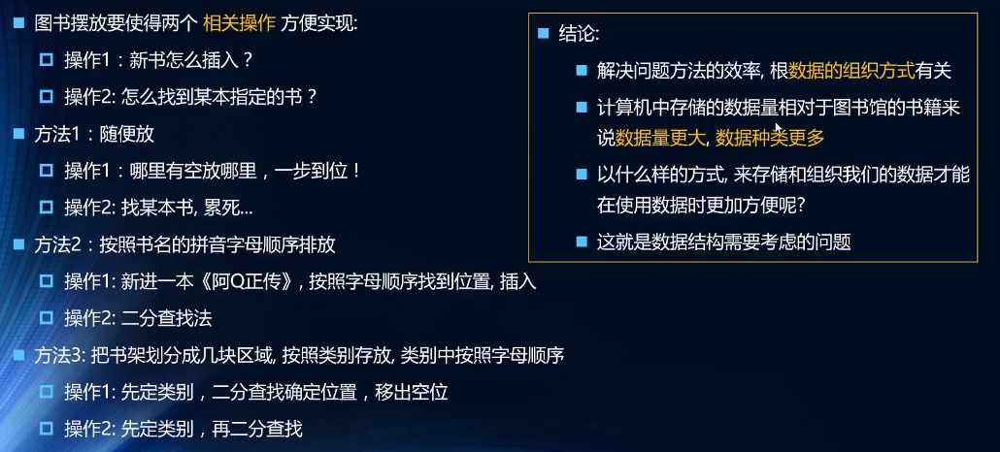

## 概念
### 数据结构是什么
- 数据结构是`数据对象`,以及存在于`该对象的实例`和`组成实例的数据元素`之间的各种联系
- 数据结构是计算机中`储存`、`组织数据`的方式，抽象数据类型的物理实现，好的数据结构的实现离不开算法
- 是一种`组织数据`的方式

### 数据结构和算法的重要性

## 线性结构
### 数组
### 栈
### 队列
### 链表

## 哈希表
### 哈希表理论
### 自定义哈希表

## 树结构
### 树的相关概念
### 二叉搜索树
### 树的遍历
### 二叉搜索树
### 其他补充 

## 图结构
### 图相关概念
### 图的表示
### 自定义图
### 图的遍历

## 排序&算法
### 简单排序
### 高级排序