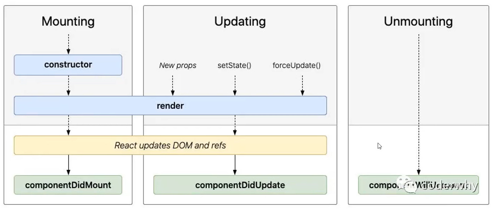
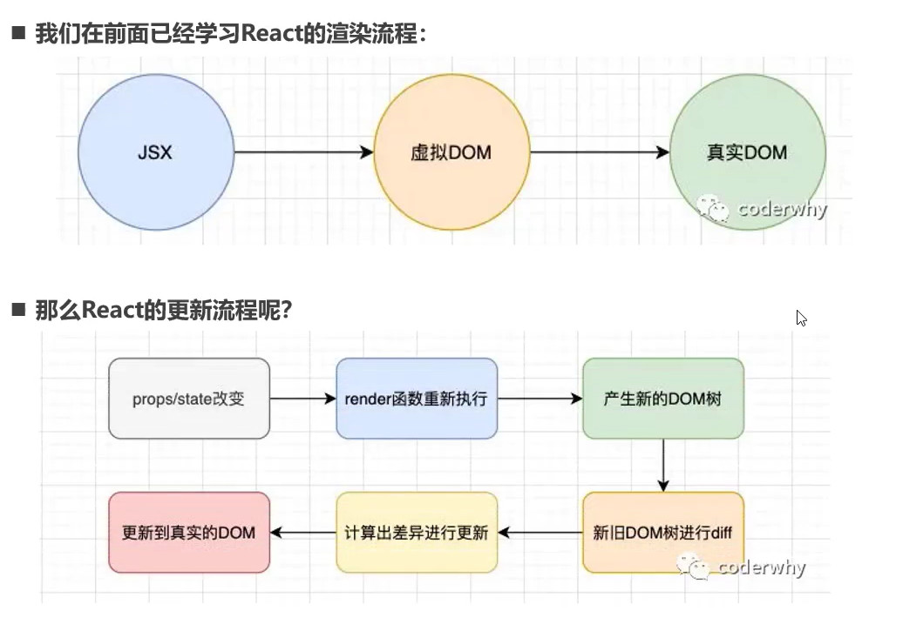
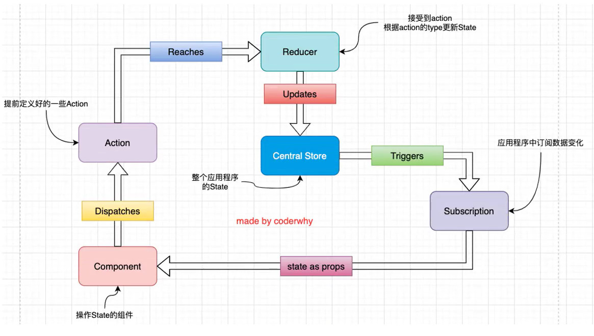

### 简介
[官网](https://zh-hans.reactjs.org)

声明式编程：（维护状态，根据状态改变更新熏染UI界面） UI=f(state）

组件化开发：


#### 开发依赖

必须依赖三个包

-   **react**：包含`react`所有核心代码
    -   包含`react web` 和 `react-native`所共同拥有的核心代码

-   **react-dom**：`react` 熏染在不同平台所需要的核心代码
    -   针对`web` 和`native`所完成的事情不同
    -   web端：`reacte-dom`会将`jsx`最终渲染成真是DOM,显示在浏览器中
    -   native端：`react-dom` 会将`jsx`最终渲染成原生控件

-   **babel**：将jsx转换成React代码的工具

---

#### 对比vue

react：用户手动 setState 的时候 去重新执行 render 函数

vue：data数据改变直接劫持重新渲染模板

### 组件

将页面**拆分**为无数个**小的组件**，每个组件完成自己的**独立功能**，**方便**页面的**关联**与**维护** 与 **复用**

每个**单页面**应用就是一棵**组件树**，么个组件都将 **state 数据** 、**方法**、**render** 关联起来

组件类型，前面的**注重UI**， 后面的**注重逻辑**

>   根据组件**定义方式**：**函数组件 **和 **类组件**

>   根据内部是否有**状态需要维护**：**无状态组件** 和 **有状态组件**

>   根据组件**职责**：**展示型 组件** 和 **容器型组件**

#### 类组件 rpce

```react
/**
 * 1、组件名称必须大写开头  
 * 2、类组件必须继承 React.Component
 * 3、必须实现 render，也是唯一必须实现的
 *
 */
class App extends React.Component {
    constructor() {
        super();
        // 组件数据，this.state 固定的，不能改变
        this.state = {
            message: "Hello World"
        };

        // 对需要绑定的方法, 提前绑定好this，class下默认绑定的this是undefined，箭头函数就不需要了
        this.btnClick = this.btnClick.bind(this);
    }

    // 组件方法(实例方法)
    btnClick() {
        // setState 是 React.Component 继承的方法  
        // 内部完成了两件事情:
        // 1.将state中message值修改掉 2.自动重新执行render函数函数
        // 2.应用类型建议不要直接该，向浅拷贝，改完，再重新全部复制过去，改变引用
        this.setState({
            message: "Hello React",
        });
    }

    /**
     *  渲染内容 render方法，名称固定 不能改变
     *  可以返回react元素、数组|字符串|数值、fragments(高级)、Portals(高级)
     */
    render() { // 里面的this 都是正常指向组件的this
        return (
            <div>
                <h2>{this.state.message}</h2>
                {/* 拿到 btnClick 指针，存到这里，没有调用，当用户点击才调用，所以默认拿不到this的*/}
                <button onClick={this.btnClick}>修改文本</button>
            </div>
        );
    }
}

// this绑定的问题
// const app = new App()
// const foo = app.btnClick
// foo(); // 默认绑定 => window => 严格模式下 => undefined  (babel 转换的和class里默认都是严格模式)

// function bar() {
//   console.log("bar:", this);
// }
// bar()

// 将组件渲染到界面上
const root = ReactDOM.createRoot(document.querySelector("#root"));
// App根组件
root.render(<App />);
```

##### 生命周期

生命周期就是事物从**创建**到**销毁**的过程，了解生命周期，可以让我们在**适合的地方**做想**要做的事情**

生命周期 和 生命周期函数的关系

-   整个生命周期有很多个阶段，react可以使**程序**走到**指定阶段**时**自动触发**（回调）相应的**生命周期函数**
    -   装载阶段（Mount），组件第一层在DOM树种被渲染的过程，组件**挂载到DOM**上就会触发`componentDidMount`
    -   更新阶段 (Update) , 组件状态发生变化，重新渲染的过程，组件**状态发生更新**触发 `componentDidUpdate`
    -   卸载阶段（Unmount），组件从DOM树中被移除的过程，就叫**即将移除**触发 `componentWillUnmount`

react 生命周期的过程



-   Mounting 挂载阶段
    -   **constructor**：创建组件实例 第一个执行 构造方法constructor 
        -   组件 都是一个类，每使用移除 <HelloX/> 都会创建一个类的实例出来 

    -   **render**：第二个执行render方法渲染 
        -   **render 完成** React 更新**DOM** 和 **Refs**

    -   **componentDidMount**：进行挂载到DOM上，挂载好就会 触发 **第一个生命周期函数**
        -   依赖dom的操作
        -   网络请求操作
        -   处理一些订阅

-   更新状态阶段
    -   **setState**：修改状态，修改完成之后**又执行 render** 重新 更新**DOM** 和 **Refs**
    -   **componentDidUpdate**：更新完成，触发**第二个生命周期函数**

-   卸载阶段
    -   **componentWillUnmount**：将组件从DOM树中移除之后触发 **第三个生命周期函数**
        -   取消一些订阅，清理操作

-   不常用的生命周期
    -   **shouldComponentUpdate**：处于 **setDate 到 render 之间**，如果返回**false**，说明**不需要重新渲染**界面 
    -   **getSnapshotBeforeUpdate**：处于 **render 到 更新DOM 之间**，获取或保存一写DOM更新前的一些信息


#### 函数组件  rfce，rmc

```react
/**
 * 与类组件的差异（不包含hook）
 *     没有生命周期，没有生命周期函数，也会被更新并挂载
 *     this 关键字不能指向组件实例
 *     内部没有状态 state,
 * 函数组件存在的缺陷
 * 		修改message之后，函数组件不知道自己要重新渲染
 *      如果页面重新渲染，函数被重新执行，又会重新改变message
 *      Hook 的出现时函数组件解决了没有state，没有生命周期等问题
 */
function App(props){
    let message = "lzoxun"
    // return 的东西与类组件的一致
    return <h1>react元素 {message}</h1>
}
export default App
```

####  组件通信

##### 父子通信（props 由父到子）

>   组件存在**嵌套关系**，**嵌进来**的组件称为**子组件**  

```react
// App.js
import React from 'react'
import Headers from "./components/Headers"
class App extends React.Component {
    constructor() {
        super();
        this.state = {
            title: '首页',
            list: [1, 2, 3, 4, 5],
            infos: {
                name: 'lzo',
                height: "380cm"
            },

            count: 0,
        }
    }

    changeCount(num) {
        this.setState({
            count: this.state.count + num
        })
    }


    render() {
        return (
            <div>
                {/* 父传子：向子组件传入一个title等数据 */}
                {/* 子传父：向子组件传入回调，接收子组件发送的数据 childExec*/}
                <Headers
                    title={this.state.title}
                    infos={this.state.infos}
                    list={this.state.list}
                    childExec={(num) => this.changeCount(num)}
                    slotele={<div>传入React元素实现插槽</div>}
                    sloteleArea={(text) => <div>{text}</div>}
                >
                    <div className='children-1'>通过子元素实现插槽效果</div>
                    <div className='children-2'>通过 this.props.children 获取组件间的子元素</div>
                </Headers>
                <div>{this.state.count}</div>
            </div>
        );
    }
}
export default App;

```

```react
/* App.js  =>  Headers.js */
import React from "react"; // imr
import PropTypes from 'prop-types' // impt 用来限制props数据类型

class Headers extends React.Component {
    constructor(props) {
        // props 接收父组件传入的所有数据
        super(props);
        this.state = {};

        console.log(this.props); // 可以直接使用
    }

    changeData() {
        this.props.childExec(3)
    }

    render() {
        return (
            <div>
                <div>父传子 =》 {this.props.title}</div>
                <div>子传父 =》 <button onClick={e => this.changeData()}>+3</button></div>
                <div className="slot">
                    <span className="left">子元素的使用 =》 left</span>
                        {this.props.children[0]} {/* 弊端就是需要多个子元素的话，所有都在列表，位置无法固定 */}
                        {this.props.slotele}
                        {this.props.sloteleArea('作用域插槽，内容自定')}
                    <span className="right">right</span>
                </div>
            </div>
        );
    }
}

// 如果需要限制类型的话，也可以用ts
Headers.propTypes = {
    title: PropTypes.string.isRequired, // 字符串类型，并且必传
    infos: PropTypes.object,
    list: PropTypes.array,
    slotele: PropTypes.element
};

// 设置默认值 
Headers.defaultProps = {
    list: [],
    infos: {},
    slotele:<div>默认</div>
}

export default Headers;


```

##### 非父子隔层通信

>   官方提供的 Context ，数据共享，后期可以用redux代替

```react
/* App.js  =>  HeadersChild.js */
```

>   EventBus 事件总线，可以监听触发事件传值

#### setState 详细使用

```react
/* 1、基本用法 */
this.setState({
	message: "hello word"
})

/* 2、回调函数 */
this.setState((state,props)=>{
    // 可以先处理 state,props
    return {
        message: "hello word"
    }
})

/** 
 * 3、setState 在 react 事件处理中默认是异步调用 
 *    - 异步可以提升性能，获取同一阶段 多个setState改变，批量更新
 *    - 如果是同步的，setState 后，render 还没有执行，state和要给子组件的props不能保存同步
 *    - 
 *    - 第二个参数回调中可以拿到最终结果
 */

this.setState({
	message: "hello word"
},()=>{
     console.log("++++++:", this.state.message) // 拿到更新后的数据
})

/* 4、react 18 之前的同步做法，不是React事件的回调就能同步，之后全部setState做法都是异步的 */
 setTimeout(() => {
     // 在react18之前, setTimeout中setState操作, 是同步操作
     // 在react18之后, setTimeout中setState异步操作(批处理)
     this.setState({ message: "hello word 111" })
     console.log(this.state.message)
 }, 0);

/* 5、偏要实现同步效果，使用官方的 flushSync*/
import { flushSync } from 'react-dom'
flushSync(() => {
    this.setState({ message: "你好啊, 李银河" })
})
console.log(this.state.message) // 设置后先执行render，再执行这里
```

>   数据不可变

应用 类型数据不要去直接修改，如果有变化，解构出来，改好直接，全部替换过去，否则 **PuerComponent** 类组件里不会生效

#### 优化

##### 更新机制



-   通过唯一的、不变的key对比新旧DOM树，尽量复用
-   dom树中不会跨层比较

##### shouldComponentUpdate （SCU）

-   阻止 render 函数被随意执行

-   父组件 **setState** 被调用，即使**数据没变**， **render函数**会被**重新执行**，**所有子组件**都会重新渲染

```react
/* 原理通过生命周期 shouldComponentUpdate(nexeProps,newState) SCU拦截优化*/
shouldComponentUpdate(newProps,newState){
    if(this.state.message != newState.message){
        return true
    }
    return false
}

/* 子组件 拦截*/
shouldComponentUpdate(newProps,newState){
    if(this.props.message != newProps.message){
        return true
    }
    return false
}

/* 上面太繁琐，react提供的解决方案 */

/* 类组件 Component 换成 PuerComponent 帮做我们浅层比较上面的朝操作*/
import React from 'react'
import Headers from "./components/Headers"
class App extends React.PuerComponent {
    constructor() {
        super();
        this.state = {}
    }

    render() {
        return (
            <div></div>
        );
    }
}
export default App;

/* 函数组件 通过memo处理上面的问题*/
/* 正常情况下，通过memo包裹的组件，只有props发生改变，组件才会重新渲染 */
const PropFile = memo(function(props){
    return <h2>{prop.message}</h2>   
})
```

##### React Refs 获取 dom

>   ref

```react
import React, { createRef, forwardRef } from 'react'
import Headers from "./components/Headers"

// 通过 forwardRef 定义一个函数组件
const Headers2 = forwardRef(function(props,ref){
    retrun (
        <h1 ref={ref}>Headers2 h1</h1>
    )
})

class App extends React.PuerComponent {
    constructor() {
        super();
        this.state = {}
        
        this.titleRef = createRef();
        this.titleEl = null;
        this.headRef = createRef();
        this.headRef2 = createRef();
    }
    
    getNatDom(){
        // 1、直接获取
        console.log(this.refs.lzo);
        
        // 2、提前创建好ref对象，绑定到元素上
        console.log(this.titleRef.current)
        
        // 3、通过回调得到元素 赋值给 this.titleEl
        console.log(this.titleEl)
        
        // 4、类组件：通过 ref 获取，函数组件没有实例所有无法获取
        console.log(this.headRef.current) 
        
        // 5、函数组件，需要forwardRef,拿到 里面的某个节点，如 h1
        console.log(this.headRef2.current) // 得到 <h1>Headers2 h1</h1>

    }

    render() {
        return (
            <div ref='lzo'>1</div>
            <div ref={this.titleRef}>2</div>
            <div ref={el => this.titleEl = el}>3</div>
            <Headers ref={this.headRef}/>
            <Headers2 ref={this.headRef2}/>
            <button onClick={e => this.getNatDom()}></button>
        );
    }
}
export default App;
```

##### 受控组件与非受控组件

>   react 没有双向搬到，当表单元素绑定 value属性后就变成了 **受控组件**，值交给react控制
>
>   受控组件是**无法输入**的，只能通过 **onChange** 事件来操作，通过事件对象拿到最新value，赋值到到state上

```react
import React, { Component } from 'react'

export class BrotherOne extends Component {
    constructor() {
        super()
        this.state = {
            name: "default"
        }
    }

    changeInput(e) {
        console.log(e.target.value)
        this.setState({
            name: e.target.value
        })
        // 或 批量写法
        this.setState({
            [e.target.name]: e.target.value
        })
    }

    render() {
        return (
            <div>
            	<input value={this.state.name} name='name' onChange={e => this.changeInput(e)} />
                {/* 非受控组件 */}
                <input defaultValue={this.state.name} />
            </div>
        )
    }
}

export default BrotherOne
```

#### 高阶组件（HOC）

>   高阶函数：接收**另外一个函数**作为**参数** 或 **返回一个函数**作为**返回值** 的函数 
>
>   高阶组件：本身就是一个函数，接收一个**组件**作为**参数** 并且 **返回一个新的组件**，在渲染之前**拦截**，处理到新组件后返回

应用场景

-   代替了**Mixin**混入

-   对组件注入数据 
-   封装隔代传值的Context
-   **memo**就是一个高阶函数，性能优化也是通过高阶组件方式实现的
-   使用大量HOC，包裹太多层嵌套，也不好，然后出现了**Hooks**

```react
// 高阶组件,给使用的组件添加上 title
export default function setTitle(WarpperComponent) {
    return function (props) { // 函数组件中操作
        console.log({...props}); // 将父级本来就有的props 和 我们要新增的数据 一起传递给子组件将
        return <WarpperComponent {...props} title='成功使用高阶组件 setTitle' />
    }
}

// 使用
import React, { PureComponent } from 'react'
import setTitle from './my-hoc/setTitle'

export class App extends PureComponent {
    render() {
        const { title } = this.props;
        return (
            <>
                <div>App - {title}</div>
            </>
        )
    }
}

export default setTitle(App)
```


#### 高阶应用

##### createPortal (vue3 Teleport)

>   **createPortal**：将React元素挂载到 root 外的其他位置

``` react
import { createPortal } from 'react-dom'

// jsx中
export class CreatePortal extends PureComponent {
  render() {
    return (
        createPortal(<div>createPortal</div>,document.querySelector("#lzo")) 
        {/* lzo元素必须提前存在 */}
    )
  }
}
```

##### Fragment (vue3 Fragment)

>   **Fragment**：包裹一段代码而不渲染到页面上，存在类**似 key的属性**无法使用

```react
import { Fragment } from "react";

// jsx中
rendel(){
    return (
        <Fragment>
            <div>
                <div>下面是 Fragment 语法糖，</div>
                <>
                </>
            </div>
        </Fragment>
    )
}
```

#####  Suspense

>   异步加载未加载出来时，先使用fallback中的组件

```react
const root = ReactDOM.createRoot(document.getElementById('root'));
root.render(
    <HashRouter>
        <Suspense fallback={<h3>Loading...</h3>}>
            <App />
        </Suspense>
    </HashRouter>
);
```


##### StrictMode

>   StrictMode：仅在开发模式下生效的严格模式，也不会渲染到页面上

检测范围，检测到报错提示

-   识别不安全不推荐生命周期
-   废弃API
-   第一种过期的refs用法
-   检测一些意外副作用
    -   **开发环境**中 **constructor**，**生命周期** 会被**故意调用两次**，查看你的代码执行多次时是否会产生一些问题（如事件没有移除）

###  JSX 

>   认识 JSX

概念

-   JSX 是一种 JavaScript 的语法扩展，或称为 `JavaScript XML`
-   它用于描述**UI界面 view,** 并且**完全**可以和J**avaScript融合在一起**
-   它不同于vue的模板语法，**不需要**专门学习模块语法中的**一些指令**（比如v-for，v-if）
-   React 认为 **逻辑渲染**本质上与其他**UI逻辑**存在很强的**内在耦合**（关联性强），所以选择 JSX
    -   UI 中绑定事件
    -   展示数据状态
    -   状态改变又要改变 UI

位置

```react
render(){
    retrun (); // 这里面 或 放到这里使用的，就是jsx,运行会被bable转成js代码 
}
```

> 书写规范 `retrun () 中`

-   只能有**一个根元素**
-   **小括号**，使 JSX 可以换行书写，方便阅读
-   单标签必须 `/>`结尾

#### 使用

-   作为子元素`{}`插入内容 **Number**、**String**、**Array** 可以直接显示，**undefined**、**null**、**boll ** 不显示，**Object对象** 不能直接插入

```react
// 1.定义App根组件
class App extends React.Component {
    constructor() {
        super();
        this.state = {
            message:'note',
            count:0,
            arr:[1,2,3,4],
            isReady:true
            
        }
        
        this.btnClick = this.btnClick.bind(this);
    }
    
    btnClick(){console.log(this)}
    btn2Click = ()=> console.log(this);
    btn3Click(){console.log(this)};
    btn4Click(event, name, age) {console.log(event, name, age)}

    render() {
        const {message,count,arr,isReady } = this.state;
        const countAdd = count + 1;
        
        let ele = null;
        if(isReady){
            ele = <h1>h1</h1>
        }else{
            ele = <h2>h2</h2>    
        }
        
        return (
            { /* 注释 */ }
            <div>
                { /* 1、注释 */ }
                { /* 2、插入内容变量 */ }
                <h2>{message}</h2>
                
                { /* 3、插入表达式 没有计算属性，可以直接通过js完成*/ }
                <h2>{1+2}</h2>
                <h2>{countAdd}</h2>
                
                { /* 4、调用方法 */ }
                <ul>{arr.map(item=> <li>{item}</li>)}</ul> 
                <ul>{this.getItem}</ul> 
                
                { /* 5、绑定属性 */ }
                </img>
                <h2 className="box" >绑定类</h2> { /* class 是关键字，bable解析可能会产生误解 */ }
				<h2 className={`box1 box2 ${countAdd==2?'box3':'box4'}`} >绑定类</h2> 
                
                { /* 6、绑定样式 */ }
                 <h2 style={{color: "red", fontSize: "30px"}}>呵呵呵呵</h2>
                
                { /* 7、绑定事件 小驼峰*/ }
                 <button onClick={this.btnClick}>修改文本</button>
                 <button onClick={this.btn2Click}>按钮2</button>
                 <button onClick={() => this.btn3Click()}>需要执行</button> 
                 <button onClick={(event) => this.btn4Click(event, "why", 18)}>按钮4</button>
                
                { /* 8、条件渲染 js怎样就怎样 */ }
                <div>{ele}</div>
                <div>{ isReady?<h1>h1</h1>:<h2>h2</h2>  }</div>
                <div style={{display:isReady ? 'block': 'none'}}>v-show </div>
                
                { /* 9、列表渲染 ，如果添加限制，向把arr处理一下再遍历 */ }
                <div>{arr.map(item=> <div className='item'>item</div>)}</div>
            </div>
        );
    }
    
    getItem(){
        { /* 如果复杂的逻辑 */ }
        retrun this.state.arr.map(item=> <li>{item}</li>)
    }
}

const root = ReactDOM.createRoot(document.querySelector("#root"));
root.render(<App />);
```

>   Bable 解析 JSX 

```react
{/*
	React.createElement(type,config,children)
	
	1、bable 将每一个 div 转换为 React.createElement("div",null,null)
	通过 createElement 组成一个 JavaScript对象树，形成虚拟DOM
	
	2、再通过 document.createElement("dov") 转真实DOM
	
	有一个从 jsx -> 虚拟DOM（js对象 ） -> 真实DOM的过程 
	  （jsx没有v-for，事件绑定这些，比较简单，bable可以直接解析，vue比较麻烦，template 通过v-loader来解析）
	  
	 虚拟DOM的好处
	 	- 可以在家js中通过diff算法对比新旧虚拟dom，部分更新
	 	- 动态判断是渲染成web端可以用的DOM结构，或渲染成其他各个平台认识的结构，实现跨平台
	 	- 通过root.render 让虚拟DOM和真实DOM同步起来，这个过程叫做协调
	 	- 只需要告诉react让ui展示什么状态，react去匹配，你不需要手动操作dom、属性、事件，实现声明式编程 
*/}

return (
    <div>
    	<ul>
            <li className='item'>Text</li>
            <li className='item'>Text</li>
        </ul>
    </div>
)

// 转换后
React.createElement("div",null,
	React.createElement("ul",null,
    	React.createElement("li",{className:'item'},Text)
    )
)
```

### 过渡动画

>   React 社区维护的动画库 `react-transition-group`

```react
// 1、需要额外安装  npm install react-transition-group -S

/**
 * CSSTransition：常用这个来完成过度动画
 *	  动画进入的三个阶段 
 *        1、开始状态初始化 xxxx-enter   如 opacity:0
 *        2、执行动画阶段 xxxx-enter-active    如 opacity:1
 *        3、执行完成阶段 xxxx-enter-done 
 *    动画离开的三个阶段 
 *        1、开始状态初始化 xxxx-exit         如 opacity:1
 *        2、执行动画阶段 xxxx-exit-active    如 opacity:0
 *        3、执行完成阶段 xxxx-exit-done 
 * SwitchTransition：两个组件显示和隐藏
 * TransitionGroup：包裹多个动画组件，一般用于列表中元素动画
 *
 *
 */
```

### React 中的 CSS

组件化的是**局部的**，而CSS的设**计是全局**的，所有组件化项目中，需要一个**CSS的解决方案**

1.   编写局部CSS：让CSS具备自己的**作用域**，不会**随意污染**其他组件内的元素
2.   编写动态CSS：获取当前组件的一些**状态**，**根据不同的状态** 来 **生成不同的CSS**

#### 常用编写方案

##### 内联样式

>   在jsx中通过style接收一个小驼峰命名属性的样式表对象，并且可以应用state中的状态来设置相关样式

```react
 <h2 style={{color: "red", fontSize: `${titleSize}px`}}>呵呵呵呵</h2>
```

##### 普通css

>   编写普通css文件，通过 import "xx/xx/xx.css" 映入到组件，缺点：一个组件引入过，其他组件也会生效

```react
import './index.css'
```

##### CSS modules

>   CSS modules 并不是react特有的解决方案，而是**webpack提供**的，webpacd.config.js 中的 modules:true

```react
import CssIndex from './index.module.css' // 无论是css/scss/less 在正常名字上添加.module就可以

 <h2 className={CssIndex.title}>呵呵呵呵</h2>

/*
	不能使用index-header 横杆写法
	不方便动态修改
*/
```

##### css in js

>   CSS 由 JavaScript 生成，而不是外部引入，由第三方库提供

优点

-   赋予CSS一些能力，样式嵌套、函数定义、逻辑复用动态修改
-   CSS预处理器功能类似，这个**动态状态**更方便
-   常见实现`css in js`库：`styled-components`、`emotion`、`glamorous`

```react
// 1、安装: npm install styled-components -S

// 2、常见 style 组件
import styled from "styled-components"
import { largeSize } from "./style/variables" // 引入入全局变量,假设有 export const largeSize = "18px"

// 2.1 标签模板字符串，调用styled的div方法，得到一个div组件
// 2.2 可以接收外部传入的props
// 2.3 styled.div.attrs({})``
// 2.4 从变量文件导入全局的变量 largeSize ，并使用
export const AppWrapper = styled.div` 
	.select{
		color:#f00;
		font-size:${largeSize}
	}
	.title{
		font-size:${props => props.size}px;
		.left{
			color:#f0f
		}
	}
`

// 3、jsx 中使用
import { AppWarpper } from "./style"

class App extends React.Component {
    constructor() {
        super();
        this.state = {
            size:30
        }
    }
    render() {
        const { size } = this.state;
        retrun(
            {/* div组件 会渲染成一个div标签，样式组件可以层层嵌套 */}
            {/* 状态改变，样式自动更新 */}
            <AppWarpper size={size}> 
                <div className='select'></div>
                <div className='title'>
                    <div className='left'></div>
                </div>
            </AppWarpper>
        )
    }
}

// 4、vscode 安装 vscode-styled-components 插件高亮
```

>   标签模板字符串，函数的其他调用方式

```javascript
function tagTmpStr(...arg){
    console.log(arg);
}

let num = 10;
let tag = '学习'
tagTmpStr(1,2);
tagTmpStr`this is ${num} 个 ${tag}`  // [['this is','个',''], 10, 学习]
```

#### classnames 动态添加类

```react
import classNames from 'classnames'

classNames('foo', 'bar'); // => 'foo bar'
classNames('foo', { bar: true }); // => 'foo bar'
classNames({ 'foo-bar': true }); // => 'foo-bar'
classNames('a', ['b', { c: true, d: false }]); // => 'a b c'
```

### Redux 状态管理

>   纯函数

**函数式编程**非常重要的概念**纯函数**，**组件**、**redux 的 reducer** 也必须是纯函数

**纯函数：**

-   相同的**输入**，得到的**返回值一定相同**
    -   所有函数不能依赖外部变量  
-   函数内部的操作**不能影响外部的数据**
-   优点：写纯函数的时候，**只需要**关心业务逻辑，**不需要**考虑**传入的内容**是怎么获得，或**依赖的外部变量**是否已经**发生修改**

>   作用

Redux 就是帮助我们**管理State的容器**，Redux是 JavaScript的状态容器，提供了**可预测的状态管理**  

Redux 必须通过 **派发（dispatch）action**来**更新数据**

>   三大原则

**单一数据源**：一般一个项目只创建一个store，方便state的**维护、追踪、修改**

**State是只读的**：唯一修改的方法是**触发action**，通过reducer产生，视图和网络请求也只能通过action描述自己想要修改的state，保证所有修改集中化处理，并按照严格书序来执行

**使用纯函数来执行修改**：通过 reducer 将就的state，和新的action联系在一起，返回新的state

>   基础流程图



#### 使用

```react
// yarn add redux  //node 16.10.0 或 >=18.0.0

// 一般结构
store/index.js

store/reducer.js

store/actionCreators.js

store.constants.js
```


#### Action

#### Reducer

>   reducer 是一个纯函数，作用是将传入的state和action结合起来生成一个新 的state

#### toolkit

```shell
npm install @reduxjs/toolkit react-redux
```

>   Toolkit 核心API

-   **configureStore**：包装`createStore`，提供**简化的配置选项**和**良好的默认值** ，自动组合 `slice reducer`、添加任何**Redux中间件**、`redux-thunk`默认包含、启用`Redux DevTools Extension`
-   **createSlice**：接收reducer函数的对象、切片名称和初始状态。并自动生成reducer，并带有相应actions
-   **createAsyncThunk**：异步数据操作
####  Redux 中间件如何实现

>   派发actions之前拦截，做一些事情（redux-thunk 拦截actions，判断内容是不是一个函数，如果是，就执行得到结果，再继续）

```react
// 中间件原理，对每次派发的action进行拦截，打印日志案例
export default function log(store){
    // 保存我们 拦截操作前的 dispatch
    const next = store.dispatch;

    function logAndDispatch(action){
        console.log('派发前：',action);
        
        // 操作完进行它原本的派发操作
        next(action);

        console.log('派发后：',store.getState());
    }

    // Monkey Patching：猴补丁 => 篡改现有代码，对整体逻辑进行修改
    // 任何地方执行dispatch 其实是执行 logAndDispatch
    store.dispatch = logAndDispatch;
}
```

#### 开发中如何管理state好

1.   有些人，将所有状态放到redux，状态管理库中**方便追踪和共享**
2.   有些人，将某些组件**自己的状态**放到组件内部进行关联
3.   建议组件ui相关的一些状态，或自己的状态放到组件内部管理，共享状态，包括请求的数据可以交给redux维护 
4.   ...具体情况具体评估


#### 调试工具

>   React Developer Tools


>   Redux DevTools

控制台 redux 数据默认是看不到的，建议开发环境开启，生产环境关闭

### React Router 6.x

```shell
npm install react-router-dom # react 社区维护
```

>   基本使用

1.   配置路由类型 **BrowserRouter** 和 **HashRouter**

```react
// index.js 
import React from 'react';
import ReactDOM from 'react-dom/client';
import { HashRouter } from 'react-router-dom'; // 使用配置 HashRouter


const root = ReactDOM.createRoot(document.getElementById('root'));
root.render(
	<HashRouter>
        <App />
    </HashRouter>
);

```

2.   路由映射路径，与路由传参

``` react
import React, { PureComponent } from 'react'
import { Link, NavLink, Navigate, Route, Routes } from 'react-router-dom'
import Home from './pages/Home'
import About from './pages/About'
import Login from './pages/Login'
import NotFound from './pages/NotFound'
import HomeChild1 from './pages/HomeChild1'
import HomeChild2 from './pages/HomeChild2'

export class index extends PureComponent {
    // constructor() {
    //     super();
    // }
    render() {
        return (
            <div>
                <div> 
                    <div>header</div>
                    <div className='nav'>
                        {/* 1、不重要 */}
                        <Link to="/home">首页</Link>
                        <Link to="/about">关于</Link>
                        <Link to="/login">登陆</Link>

                        {/* 2、不重要  激活自动添加 active 类,动态加style 和 className */}
                        <NavLink to="/home" style={({ isActive }) => ({ color: isActive ? "#f00" : "" })}>首页</NavLink>
                        <NavLink to="/about" style={({ isActive }) => ({ color: isActive ? "#f00" : "" })}>关于</NavLink>
                        <NavLink to="/login" style={({ isActive }) => ({ color: isActive ? "#f00" : "" })}>登陆</NavLink>

                        {/* 3、Navigator 一出现，就会立刻跳转对应路径(配合逻辑判断使用) */}
                        {/* <div>{isToLogin ? <Navigate to="/Login" /> : "暂不跳转"}</div> */}

                        {/* 4、自己或通过js实现跳转 6.x版本类组件无法使用 hook useNavigate ,需要通过高阶组件*/} 
                    </div>
                    <hr />
                </div>
                <div className='content'>
                    {/* router2、映射关系表：path => Component */}

                    <Routes>
                        <Route path='/' element={<Navigate to="/home" />}></Route>  
                        {/* 5.x  用 component 代替 element，还需要用属性 exact 精准匹配 */}
                        <Route path='/home' element={<Home></Home>}>
                            <Route path='/home' element={<Navigate to="/home/c1/456" />}></Route>
                            {/*动态路由传参*/}
                            <Route path='/home/c1/:id' element={<HomeChild1></HomeChild1>}></Route> 
                            
                            {/*用于query传参*/}
                            <Route path='/home/c2' element={<HomeChild2></HomeChild2>}></Route> 
                        </Route>
                        <Route path='/about' element={<About></About>}></Route> 
                        <Route path='/login' element={<Login></Login>}></Route>
                        <Route path='*' element={<NotFound></NotFound>}></Route>
                    </Routes>

                </div>
                <div>footer</div>
            </div>
        )
    }
}

export default index
```

3.   封装高阶组件，时类组件也能用 react-router-dom 库提供的 hook

```react
// withRouter.js
import { useLocation, useNavigate, useParams, useSearchParams } from 'react-router-dom'

// 高阶组件
export default function withRouter(WarpperComponent) {
    return function (props) {
        // 导航跳转
        const navigate = useNavigate();

        // 获取动态路由参数
        const params = useParams();

        // 获取query参数(未解析)
        const location = useLocation();

        // 获取解析好的query参数 
        const [searchParams] = useSearchParams() // 返回一个数组，数组里有一些方法
        /**
         *   URLSearchParams 接口定义了一些实用的方法来处理 URL 的查询字符串。
         *      searchParams.get('a') 得到对象a属性的值
         *      将 Object.fromEntries(searchParams.entries()) 数据转成对象
         */
        const query = Object.fromEntries(searchParams.entries());

        const router = { navigate, params, location, query };
        return <WarpperComponent {...props} router={router} />
    }
}
```

```react
// 使用
import React, { PureComponent } from 'react'
import { Link, Outlet } from 'react-router-dom'
import { withRouter } from '../hoc'
export class Home extends PureComponent {
    navigateTo(path) {
        let { navigate } = this.props.router; // useNavigate 类组件不能用，通过高阶函数返回函数组件，传递过来
        navigate(path);
    }

    render() {
        return (
            <div>
                <div className='home-header'>
                    <Link to="/home/c1/123">子路由1</Link>
                    <Link to="/home/c2?a=1&b=2">子路由2</Link>
                    <button onClick={e => this.navigateTo("/about")}>js跳转</button>
                </div>
                <div className='home-centert'>
                    {/* 占位组件 类似vue的 router-view */}
                    <Outlet></Outlet>
                </div>
            </div>
        )
    }
}


export default withRouter(Home)
```

3.    路由配置
     1.   router5.x 需要安装**react-router-config**才能提取单独配置文件，6.x 直接就能用

### React Hooks

>   hook ( hook into ) 钩入，意思是可以从其他地方，将保存好的状态钩入进来（如useState钩入状态）

1.   Hook解决了**类组件复杂的**的问题，弥补了 **函数组件**一些不足的地方
2.   可以在不编写class的情况下使用state状态管理，什么周期以及其他React特性
3.   是否使用Hook是可选的，完全向下兼容，不需要将旧代码重构成hook

>   注意事项

1.   Hook能在**函数组件**中，并且是**最外顶层**使用，不能在**类组件** 或者 **函数组件之外的地方**使用
2.   Hook也能在自定义hook中使用（React中必须是  useXxx 格式的函数名）

#### useState 

>   设置与获取函数组件状态，从react中导入，是一个hook

```react
import React, { useState } from 'react'

/**
 *  useState
 *      参数：只有一个参数，初始化值，不设置位undefined
 *      返回值：数组，包含两个元素 [状态单前值，设置值的函数]
 *      作用和 类组件的 this.state 是
 *   
 *  点击button后做两件事情，通过 setCounter 重新设置值，同时将新的值返回过来，渲染到页面上
 */


function CountHook() {
    const [counter, setCounter] = useState(0); // 首次 counter 变量 默认为0
    return (
        <div>
            <div>
                counterVal: {counter}
                <button onClick={e => setCounter(counter + 1)}>+1</button>
                <button onClick={e => setCounter(counter - 1)}>-1</button>
            </div>
        </div>
    )
}

export default CountHook
```

#### useEffect

>   由于生命周期中某阶段**网路请求**、**手动更新DOM**、**事件监听**，都是**React更新DOM**的**副作用**（Dide Effects）

>   所有完成这些功能的Hook 官方称为 Effect Hook

```react
// useEffect 主要是为了处理 以前生命周期的很多逻辑
useEffect(() => {
    // 当前回调函数绘制组件被渲染完成后，自动执行 （网络请求、DOM操作、事件监听）
    document.title = counter;

    // 返回值，需要返回一个回调函数 ==> 组件被重新渲染，或者组件被卸载的时候执行
    return () => { 
        // 清除机制，做一些取消定时器，销毁的操作
    }
});

useEffect(() => {})  // 可以多个 按顺序执行
```

>   每次渲染组件，默认情况下都会走 effect，所以需要 effect 性能优化

```react
// 参数二 ，第二次渲染是，只有在数组中的状态发生改变，才会再次执行 回调(空数组说明，永远不会再次执行了)
useEffect(()=>{
    console.log('只执行一次，发生网络请求')
    return () => { 
        console.log('只有组件被卸载才会执行')
    }
},[])
useEffect(()=>{
    console.log('counter 发生变化就会执行')
},[counter]) // 有点像vue watch的 监听counter,状态发生改变就做一些事情
```

#### 特殊场景使用的hook

>   useContext (子子孙孙传参)

>   useImperativeHandle(作用子组件暴露一些方法，给父组件通过ref使用)

>   useLayoutEffect ( **useEffect** 组件**渲染完成**之后执行里面，这个是在渲染DOM更新之前（阻塞），先做一些事情，再更新DOM)

#### 性能优化hook

>   useRef（总是返回同一个对象，操作dom）、useCallback 和 useMemo

#### 自定义hook

>   本质上只是**函数代码逻辑的抽取**

#### React18 新增 hook

#### redux hook

>   以前必须通过 react-redux 的 connect 编写 mapStateToProps 和 mapDispatchToProps 管理 react 和 redux

##### useSelector

>   可以将 state 映射到组件中

```react
// useSelector 代替 mapStateToProps
// 默认情况下useSelect监听的是整个state，当某个组件状态发生改变时，所有使用useSelector的子组件都会重新渲染
const { homename, banners } = useSelector((state) => {
    return {
        homename: state.home.homename,
        banners: state.home.banners
    }
})

// shallowEqual 比较数据是否发生改变，不受其他组件状态变化影响，比较自己的状态如果没变化，就不需要重新渲染
const { homename, banners } = useSelector((state) => {
    return {
        homename: state.home.homename,
        banners: state.home.banners
    }
},shallowEqual)
```

##### useDispatch

>   直接获取dispatch函数

```react
// useDispatch 代替 mapDispatchToProps
const dispatch = useDispatch();

function view_change_name(name) {
    dispatch(changeHomeNameAction(name))
}
```


### React ClI

>   建筑学的概念，表示搭建建筑物时，**临时搭建**出来的**一个框架**，处理里一些问题，

-   目录机构组织
-   管理文件直接的相互依赖
-   管理第三方依赖
-   发布前的压缩打包。。。
-   浏览器不认识的代码转换
-   所有webpack相关的都存到 `react-scripts` 中了，`执行 npm run `就可以弹出，就能看到了，**不可逆**

>   PWA

-   `Progressive Web App` 渐进式WEB应用
-   首先是一个**网页**，通过**Web技术编写**出一个**网页应用**
-   随后添加**App Manifest** 和 **Service Worker** 来实现**安装和离线缓存**等功能 
    -   App Manifest：手机上某些浏览器（如Google）右上角更多里面，将页面添加到桌面，看上去就跟app差不多
    -   Service Worker：当没网的时候打开这个Web App，还能看到上一次浏览的一些东西
-   这种Web存在的形式 称为 **Web App**
-   作用: 添加到**主屏幕**、**离线缓存**、**消息推送**等 一系列NativeApp的相关功能

#### create-react-app(CRA)

```shell
# 1、全局安装 npm install create-react-app -g
# 2、创建 create-react-app <object-name>    - 不允许存在大写字母
# 3、 cd   yarn start

# 目录结构
#     public 一些静态文件
#         index.html、favicon.ico 入口文件，标题图标
#         两个logo.png、manifest.json 都是配置 PWA的一些资源样式配置
#         robots.txt 告诉搜索引擎哪些东西可以被爬虫爬
#     src  源码
#  
# eject 后多出     
#     config
#     scripts
```


###  配置

>   sass 直接 `npm i sass` 安装就能使用


