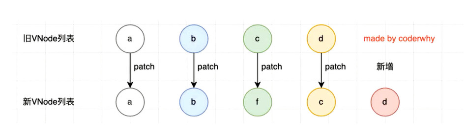
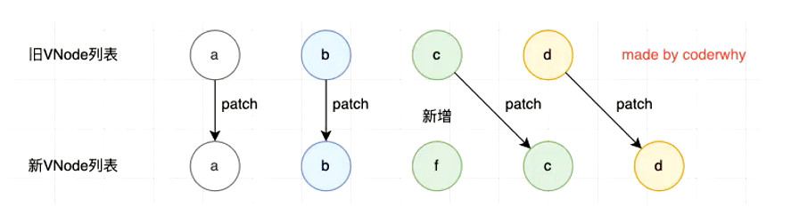

## Options Api (选项API)

#### 开启 vue 

```javascript
// 1、引入
<script src='https://unpkg.com/vue@next'></script>

// 2、创建模板内容 2.0的 options Api
const app = Vue.createApp({
    template: `<h2>hello {{msg}}!</h2`, // template的内容会覆盖app里的html，如果没写 temp vue将挂载节点里的html作为熏染模板，

    // 劫持返回的对象数据，通过 Object.defineProperty 或 new Proxy 添加到vue的响应式系统
    data: function(){ // 3.0 所有场景必须是函数 
        return {
            msg: "word",
            info: "this a info",
            coutn: 2,
            imgurl: "http://xxx/xxx/xxx.jpg",
            infos:{a:1,b:2}
        }
    }，
    // filters 部分代码 vue3已经删除，功能通过 methods 或 computed 的可以实现

    // 不可以用箭头函数(箭头无作用域，里面的this无法指向vue对象)
    methods: {
        connect_met(){
            return this.info +“ ”+ this.msg
        }
        getData(){} 
    },
    
    /**
     * 计算属性, （包含响应式数据的计算），涉及到的属性变化，结果跟着变化
     * connect 会被混入到实例中, 可以通过 this.connetc 使用
     * 和 methods差别 存在缓存
     *     模板中 {{ connect_met() }} 使用三次,执行了三次
     *     模板中 {{ connect }} 使用三次，只会计算一次
     *     this.info 和 this.msg 发生变化，自动更新 connect
     */
    computed:{
        connect(){
            return this.info +" "+ this.msg
        },
        connect2:{
            get: function(){
                return this.info +" "+ this.msg
            },
            set: function(value){
                // 一些列操作
            }
        }
    },
        
    /**
     * 注册局部组件
     * 导入的时候尽量大驼峰取名，组件名与组件是一样的就可以缩写了
     */
    components:{
        "ProductItem":ProductItem,
         ProductItem
    },
        
    /**
     * 监听属性变化，某个属性变化，去做一件事情
     *
     */
    watch:{
        info(n,o){
            
        }
        infos(n,o){
            // 整个infos发生变化，得到的n是一个 Proxy对象
            console.log(Vue.toRaw(n)) // 获取原生对象
        },
        infos:{
            handler(n,o){
                // 侦听对象某个属性变化，默认无法深度监听
                console.log(Vue.toRaw(n)) // 获取原生对象
            },
            deep:true,
            immediate:true  // 第一次立即执行
        },
        "infos.a":(n,o){
            // 直接侦听对象属性
        }
    },

	/**
	 *   生命周期
	 */
     created(){
         this.$watch("msg",(n,o)=>{},{deep:true}) // 逻辑中监听
     } 
     
    
 
})

// 3、挂载到页面已存在的节点
app.mount("#app")

```

#### 模板语法 
> template 中的语法  (react 通过jsx 编写)

mustache 语法
```javascript
/**
 * {{}}
 * {{msg}}  普通数据绑定
 * {{count*2}} {{info.split(" ")}} {{a>2?"0":"1"}} 表达式,对 data 的数据进行加工再渲染
 * {{count*2}} {{info.split(" ")}} {{a>2?"0":"1"}} 表达式,对 data 的数据进行加工再渲染
 * {{ getData(msg) }} 调用methods 的方法，传入data的参数
 */
```

基本指令

>   标签中使用 

```javascript
/**
 * v-ones   只渲染一次，数据变化指令标签内部所有data不更新
 * v-text 与 v-html 是否将带html标签的数据效果呈现
 * v-pre  标签里所有东西当做字符串 包括 {{}}
 * v-cloak 防止js未加载出来时，页面出现{{msg}} 的问题 （配合 style [v-cloak]{display:none} 才行） 
 * v-memo=[name,msg] 3.2+  v-memo指令作用的标签内部(子树)数据不实时更新，只有name 或 msg数据变化了，再一起更新
 */
```

v-bang、绑定class和style
```javascript
/**
 * v-bind  缩写 : 动态绑定属性的值
 * v-bind:src="imgurl"  或  :src="imgurl"  
 * :class={active:bool} 或  :class="getClassList()"    函数中 retrun {active:true,msg:false}
 * :style={"font-size":size + "px"}  驼峰或引号都行
 * :[namexxx]="123" // 动态绑定属性名
 * v-bind="infos" // 绑定一个对象 infos:{a:1,b:2} 直接绑定a和b连个属性
 *
 */
```

绑定事件

```javascript
/**
 * v-on 缩写 @
 * @click="getData" // 事件发生时做一件事情，直接做，或通过函数做
 * v-on={click:getData,mousemove:getData2} 批量绑定
 * @click="getData" // 没参数 event 参数默认存在
 * @click="getData($event,msg)" // 有参数，需要手动传入事件对象
 * 事件修饰符
 *     @click.stop="xxx" 阻止事件冒泡 (原生通过 event.stopPropagation() 阻止)	
 *	         .prevent    阻止默认行为	(原生通过 event.preventDefault() 阻止)	
 *           .capture    使用捕获模式
 *           .self       事件绑定原生自己触发事件才生效
 *           .ones       只触发一次
 *           .left/right/middle 点击左/右/中按键时才触发
 *
 */
```

v-model
>   表单设置双向数据绑定 ，如果手动实现，@input 的时候执行函数，手动让 其他数据变化

```html
<input v-model="selectText" />
<input :value="searchText" @input="searchText = $event.target.value" />

<!-- 修饰符，可多个同时使用 -->
<!-- v-model.lazy  失去焦点时绑定 防抖-->
<!-- v-model.number  自动将值转换为数字（vue2 中即使input type设置成number 依然会被转成字符串）-->
<!-- v-model.trim 去除首位空格-->


<!--多选框中，v-model绑定的是一个数组列表，需要额外设置每一项的value -->
<!--单选框中，需要用相同的 name 关联 ，v-model如果绑定同一个data,就可以不需要name了 ，需要额外设置value -->
<!--select中，直接给select标签v-model,value全在option中 -->

```

>   v-model 在组件上使用


条件渲染

>   这些指令最好加到 `template` 元素中, 这样就不会渲染到页面，类似小程序的`block`

```javascript
/**
 * v-if/vi-else-if/v-else 节点的删除创建
 * v-show  // display 的显示隐藏
 * v-for="(item,index) in array"  
 * v-for="(item, key,index) in object"	
 * 	可迭代对象如字符串都是可以遍历的
 */
```

>   数组更新的检测，只有改变原数组，或调用可改变元素组的方法，才会更新

key

```javascript
/**
 * v-for key 属性的作用
 * 	  唯一的，一般用id 
 *	  主要用在Vue的虚拟DOM算法，在新旧nodes对比时辨识VNodes
 *    没使用key，有一种算法，使用key会用一种更好的算法（基于key的变化重新排列元素顺序，并移除不存在的元素）
 */
```

-   VNode: `Virtual Node` 虚拟节点

    -   位置： 存在于 vue template  到  真实DOM之间
    -   本质：是一个JavaScript对象

    ```javascript
    // template: <div class="title" style="font-size:30px">{{msg}}</div>
    
    const vnode = {
        type:"div",
        props: {
            class: "title",
            style: {
                "font-size":"30px"
            }
        }
        children: "内容"
    }
    
    // DOM: <div class="title" style="font-size:30px">内容</div>
    ```

-   虚拟DOM：很多`VNode`形成的 `VNode Tree`

    -   方便跨平台

        -   可以转 真实DOM对象
        -   可以转 移动端的 `button/view/image`
        -   可以转 IOS `UIButtono/UIView`
        -   `JavaScript` ，是**脚本语言**，可以将 转换为**各个平台想要显示的东西**

    -   方便diff算法 

        -   **没有Key** ：当遍历的**数组发生变化**时，**销毁所有**的**虚拟DOM**，在按照新的数据**全部重新创建**

        

        -   **存在唯一Key**：虚拟DOM会**通过key**认识，**变化后的某个节点，就是变化前的那个节点**，不销毁进行重新排序

        


#### MVC 与 MVVM

```javascript
/**
 * MVC: `Model - View - Controller` 的简称，（前端也符合，html view - js 控制器）
 *     准备好界面  控制器去服务器获取数据  得到数据转换为模型给页面使用
 *
 * MVVM: `Model（script，data等） - View（template） - ViewModel（Vue框架`） 的简称 ，Vue给Model和View建立桥梁 
 *     ViewModel 把 Model数据 绑定到界面
 *     ViewModel 把 View事件 监听到 Model
 */
```


#### 组件化

-   初始化 App 就是根组件，一个vue项目就是一棵组件树
-   单向数据流  -> 子组件不能直接修改props的数据，如果非要修改，父组件监听子组件emit，在父组件中修改 

```javascript
// 定义一个全局组件
const productItem = {
    template: `<h1>组件</h1>`
}
// 注册一个全局组件，组件名称 短横线 或 大驼峰命名
app.component("product-item",productItem);

// 注册局部组件, 选项components
components:{
    productItem
}
```

>   组件通信

```html
<!--父组件传递与接收 组件标签通过-->
<cpn-name :name='name' :info="InfoObj" @receive="xxxx" :vis='a' abc='123' ></cpn-name>
```

```javascript
// 接收 prop 属性接收 ，横杆和驼峰命名都可以
// 父级传递 没用prop接收的属性，会变成组件中根节点的属性
// 使用 inheritAttrs:false 选项禁止, 也能手动在子节点上 通过 $attrs.abc 给其他子节点

export default {
    props:["name"], 
    props:{
        name: {
            type: String,
            default: "",
            required: true,
        },
        InfoObj: { // 对象或数字默认值必须从函数中返回
            type: Object,
            default: ()=>{ 
                return {a:1}
            }
        },
        vis: { // 自定义验证
            validator(value){
                return ['a','b','c'].includes(value)
            }
        }
    },
    emits:['receive'], // 注册一下，外面用的时候会有提示,也可以验证函数返回
	mounted(){
        this.$emit("receive",data) //子传父
    }
}
```

>   非父子组件通信 

```javascript
/**
 * Provide 和 Inject 依赖注入
 *     无论层级多深，父组件都可以通过 Provide 向它下面所有子组件提供数据
 *     子组件通过inject接收
 */

export default {
    data(){
        retrun {
            name:"liao"
        }
    },
    provide: {
        name:"liao",
        age:16
    },
    provide(){ // 通过行数使用动态数据，数据改变不会更新
        return {
            name: this.name,
            age:16
        }
    },
    provide(){ // 通过行数使用动态数据，数据改变更新
        return {
            name: computed(()=> this.name), // computed 需要从vue引入， 子组件中需要 this.name.value 展示
            age:16
        }
    },
}

export default {
    inject: ["name","age"]
}

/**
 * 事件总线
 *    mitt 或 tiny-emitter 库，Vue2 是有自带的 
 *    全局 导入总线对象 EventBusxxx
 *    需要用的地方导入 EventBusxxx，EventBusxxx.emit("EventName",data); 发出事件
 *    需要用的地方导入 EventBusxxx，EventBusxxx.on("EventName",(data)=>{console.log(data)}); 监听事件
 */

/**
 * 状态管理库 vuex
 */
```

>   组件的生命周期（生命开始到结束经历变化的一系列过程）

```javascript
/**
 * 1、创建  ---  beforeCreate、 created  （创建好后这里有一个 从 html模板编译到虚拟DOM的过程）
 *     发送网络请求、事件监听
 * 2、挂载到组件树（虚拟DOM） --- beforeMount、 mounted （挂到虚拟DOM后，同时将映射到真实DOM，界面上就可以看到）
 *     获取/使用DOM
 * 3、修改更新数据 --- beforeUpdate、 updated （根据新数据生成新VNode,形成新的虚拟DOM，根据diff算法更新真实DOM）
 * 4、卸载 --- beforeUnmount、unmounted （通过v-if可以卸载）
 *     回收操作，取消定时器/事件监听
 * 特殊阶段
 *     缓存组件的生命周期
 *     activated(){}, 激活
 *     deactivated(){} 离开    
 *
 * 我们可以在经历某个阶段做特定的逻辑代码
 * 我们可以通过生命周期函（钩子函数、回调函数）数知道所在的阶段
 */
```

>   ref  属性绑定DOM或组件实例，this.$refs.xxx 获取实例 

```javascript
this.$refs.cpnRefName // 直接操作组件里的dom、方法等
this.$refs.cpnRefName.$el

// this.$paren、this.$root 、this.$children 操作父组件、根组件、子组件（vue 2）
```

>   动态组件

```vue
<template>
    <div>
        <!-- 全局或局部注册的组件 v-for cpnList 内部-->
        <components :is="cpnList[index]"></components>
    </div>
</template>

<script>
export default {
	data(){
		cpnList:[cpn1,cpn2,cpn3]
	}
}
</script>
```

>   keep-alive 组件切换保持存活，缓存数据

```vue
<template>
    <div>
        <!--根据组件name,只缓存这包含的组件 或 exclude="cpn1" 排除 -->
        <!-- max=3 最多缓存3个 -->
        <keep-alive include="cpn2,cpn3"> 
        	<cpn1></cpn1>
    	</keep-alive>
    </div>
</template>

<script>
export default {
	data(){

	},
    components:{
        cpn1,
        cpn2,
        cpn3
    },
}
    
// 组件内部
activated(){},
deactivated(){} 
</script>
```

>   异步组件

```javascript
import("./components/cpn1.vue").then(res=>{}) // 可以对导入的文件进行分包处理 ,打包成单独文件
# vue 异步引入组件
import { defineAsyncComponent } from "vue";
const Cpn1 = defineAsyncComponent(()=> import("./components/cpn1.vue"))
```

>   组件 v-model 

```vue
<template>
    <div>
        <cpn1 v-model="msg"></cpn1> 
        <cpn1 :model-value="msg" @update:model-value="xxx"></cpn1>
        
        <cpn1 v-model:msg2="msg2"></cpn1> 
        <cpn1 :msg2="msg2" @update:msg2="msg2=xxx"></cpn1>
    </div>
</template>

<script>
export default {
	data(){
		msg:"123",
        msg2:"456"
	},
    components:{
        cpn1,
    },
}
</script>
```

>   Mixin 混入 (不常用)

```javascript
// 多组件、页面都需要用的方法、属性统一抽取
// 单独js 文件 mixin.js 定义一些东西
export default {
    data(){
        return {
            msg:123
        }
    },
    created(){
        console.log(this.msg);
    },
    methods:{
        showMsg(){
            console.log(this.msg);
        }
    }
}

// 单独引入
import msgmixin from "../xxx/mixin";
export default {
    mixins:[msgmixin], // 使用，组件中的东西会和mixin合并，如果名字一样，组件中覆盖mixin
    mounted(){
        this.showMsg(); 
    },
}


 
```


#### 插槽

>   渲染作用域：插槽所有内容都是父组件里的数据

```html
<!-- 普通插槽父组件 -->
<cpn-item>
    <button>普通插槽内容</button>
</cpn-item> 


<!-- 子组件 -->
<template>
	<div> 
        <slot><h1>没使用插槽默认展示</h1></slot> <!--<button>普通插槽内容</button> 插入这里name="default"-->
    </div>
</template>

<!-- 具名插槽父组件 v-slot:[可以是变量] #warp-->
<cpn-item>
    <template v-slot:warp>
    	<button>外面</button>
    </template>
     <template v-slot:inner>
    	<button>里面</button>
    </template>
</cpn-item> 


<!-- 子组件 -->
<template>
	<div>
        <slot name="warp"></slot>
        <span>
            <slot name="inner"></slot>
        </span>
    </div>
</template>

<!-- 数据向外传递 -->
<cpn-item>
    <template v-slot:default="props"> <!--只有默认的，可以简写成 v-slot="props"-->
    	<button>{{props.item}} - {{props.title}}</button>
    </template>
</cpn-item> 


<!-- 子组件 -->
<template>
	<div> 
        <slot :item="item" title='name'></slot>
    </div>
</template>
```

##  Composition Api （组合API）

>   将data数据，监听数据，方法数据，需要用到的组合起来完成，放在一个地方，选项API逻辑太过分散

>   组合在一起 抽取封装方便 (hooks)

```javascript
// 定义一个 hook  useCount.js
import { ref } from 'vue';
export default function useCounter(){
    let counter = ref(100);
    const increment = () => {
        counter.value++;
        console.log(counter.value)
    }
    const decrement = () => {
        counter.value--
    }
    return { counter, increment, decrement}  
}

// 组件中引用
import useCounter from "./hooks/useCounter";

export default {
    setup(){
        const { counter, increment, decrement } = useCounter();
        return { // 直接就能用复用
            counter, 
            increment,
            decrement
        }
    }
}
```


>   函数式变成思想，以前对象里的功能转变为函数的调用

setup

1.   `setup` 无this
2.   **两个属性**：props 存放父组件传递的参数，context 有 `attrs、slots、emit`
3.   template 需要用的东西 需要从setup中 `return` 出去
4.   setup 内部使用变量需要加 .value  ,retrun 到 template 中的不需要写 .value

#### Setup 上下文

```javascript
// 透传 Attributes（非响应式的对象，等价于 $attrs）
console.log(context.attrs)

// 插槽（非响应式的对象，等价于 $slots）
console.log(context.slots)

// 触发事件（函数，等价于 $emit）
console.log(context.emit)

// 暴露公共属性（函数）,父组件通过ref得到子组件实例，仅能访问expose的内容
console.log(context.expose)
```


#### Setup 实现 data  数据

```vue
<template>
    <div>
        <!-- vue 自动将count ref对象解包 不能带value，深层对象修改时需要带.value -->
        {{ count }}
        <div>
            {{ infos.username }}
        </div>
    </div>
</template>

<script>
import { ref, reactive } from 'vue';
export default {
    name: "TestPage",
    setup() {
        // ref 简单响应式数据,也可以是复杂类型数据
        let count = ref(100); // count 对应 ref对象的value
        count.value++;
        console.log(count.value);
        
        let data = ref([]); // 网络请求数据，默认[]
        const res = [{a:1},{b:2}]
        data.value = res;
        console.log(data.value);

        // reactive 复杂数据类型依赖收集, 不要关心value
        const infos = reactive({
            username: 'lzoxun',
            passwd: '123456'
        })
        infos.username = "abc";
        
        // readonly 只读代理 普通/ref/reactive对象都能传入
        const readonlys = readonly(infos)
        readonlys.username = "456"; // 无法修改

        return {
            count,
            data,
            readonlys,
            infos
        }
    }
}
</script>
```

>   响应式数据相关工具方法

```javascript
isProxy // 检测数据是否由reactive或readonly穿件的proxy
isReactave // 检测是否由reactive创建的响应式代理，readonly包裹reactive对象创建的也会返回true
isReadonly // 是否有有readonly创建的只读代理 
isRef  // 数据是否有ref创建

shallowReactive // 浅层作用: 一级属性可以响应式，但深层的不可以，只是普通数据
shallowReadonly // 浅层作用：一级属性无法修改，但深层的可以
shallowRef

toRaw // 返回 reactive 或 readonly 代理的原始对象，去除Proxy效果

const { username, passwd } = toRefs(infos) // 结构reactive数据, 成 ref数据
const username = toRef(infos,'username') //结构单个
const uncount = unref(count) // isRef(val) ? val.val : val;

triggerRef(count) // 特殊情况改变完没有响应，手动强制响应
```

#### Setup 实现 计算属性

```javascript
import { ref, computed } from 'vue';
export default {
    name: "TestPage",
    setup() {
        const count = ref(1)
        const plusOne = computed(() => count.value + 1)  // 计算属性也是一个  ref
        console.log(plusOne.value) // 2
        
        return {
            plusOne 
        }
    }
}
```

#### Setup 实现 生命周期

```javascript
export default {
    name: "TestPage",
    setup() {
        // setup 本身 取代了 created 和 beforeCreated 这连个生命周期
        
        onBeforeMount(()=>{}) // 组件挂载之前
        onMounted(()=>{}) // 组件挂载完成执行
        
        onBeforeUpdate(()=>{}) // 响应式数据变更之前
        onUpdated (()=>{}) // 响应式数据变更
        
        onBeforeUnmount(()=>{}) // 组件十六卸载之前
        onUnmounted(()=>{}) // 组件实例被卸载
        
        onActivated(()=>{}) // <KeepAlive> 的组件激活
        onDeactivated(()=>{}) // <KeepAlive> 的组件卸载
        
        onErrorCaptured(()=>{}) 
        onRenderTracked(()=>{}) 
        onRenderTriggered(()=>{}) 
        onServerPrefetch(()=>{}) 
    }
}
```

>   ref  获取 dom 节点

```vue
<template>
	<div ref='titleRef'>标题</div>
	<button ref='btnRef'>按钮</button>
</template>

<script>
	export default {
        setup(){
            const titleRef = ref();
            const btnRef = ref();
            
            onMounted(()=>{
                console.log(titleRef.value)
                console.log(btnRef.value)
            })
            
            return { // 一定要 return 
                btnRef, 
                titleRef
            }
        }
    }
</script>
```


#### Setup 实现 Provide/Inject

```javascript
import { ref, provide } from 'vue';
export default {
    name: "TestPage",
    setup() {
        // 提供静态值
        provide('foo', 'bar')

        // 提供响应式的值
        const count = ref(0)
        provide('count', count)
    }
}

// 下级组件中
import { ref, inject } from 'vue';
export default {
    name: "TestPage",
    setup() {
        // 注入值的默认方式
        const foo = inject('foo')

        // 注入响应式的值
        const count = inject('count','default value')
    }
}
```

#### Setup 实现 watch/watchEffect

```javascript
import { ref, watch, watchEffect } from 'vue';
export default {
    name: "TestPage",
    setup() {
        const message = ref("hello word");
        watch(message,(n,o)=>{ // [msg1,msg2] 可以监听多个
            console.log(n,o)
        },{
            immediate:true, // 先执行一次
            deep:true // 深度监听，默认true
        }) 
        
        
        watch(()=> ({...infos}),(n,o)=>{ // 自动收集infos 里面的所有依赖，不加小括号,大括号会被当成代码块
            console.log(n,o)
        },{
             deep:true  
        })
        
        /**
         * 里面的函数自动被执行
         * 函数内部涉及到的依赖会被自动收集，只要监听到一个发生变化，就自动再次执行这个函数
         * 返回值 调用就停止监听了
         */
        const stopWatchxx = watchEffect(()=>{
            
        }) 
        
        return {
            message
        }
    }
}
```

#### Setup script语法糖 

```vue
<!--
	1、引入组件直接使用不需要注册
    2、顶层（非函数内）的代码默认暴露给template，可以直接使用不需要return
    3、defineProps({}),代替props定义 组件接收的数据（setup语法中直接用，不需要引入）
    4、defineEmits(["infoBtnClick"]) 
    5、defineExports  暴露属性或方法到组件外（通过ref拿到组件时可以调用暴露出的方法）
-->
<script setup>
	const message = ref("msg") // 不要 return 就可以直接使用
    
    const props = defineProps({
        title:{
            type:String,
            default:"首页"
        }
    })
    
    const emits = defineEmits(["infoBtnClick"]);
    function showInfoBtnClick() {
        emits("infoBtnClicks","data")
    }
    
    // 暴露方法
    function foo(){
    	console.log("foo ")
    }
    defineExports({
        foo
    })
    
</script>
```


## 脚手架

```javascript
// 全局安装 vue
npm install @vue/cli -g

// 创建项目
vue create <project-name>
    
```

>   browserslist  设置babel转换代码的标准

```javascript
"> 1%", // 适配市场占有率大于1%的浏览器
"last 2 versions",
"not dead",
"not ie 11", // 不需要支持ie11  
```

>   jsconfig.json  让vscode提供友好的代码提示

```javascript
{
  "compilerOptions": {
    "target": "es5",
    "module": "esnext",
    "baseUrl": "./", // paths中src相对路径
    "moduleResolution": "node",
    "paths": {
      "@/*": ["src/*"],  // 当用户输入@，vscode就会提示去src/下找东西
      "utils/*":[src/utils/*] // 当用户输入utils，vscode就会提示去src/utils下找东西
    },
    "lib": ["esnext", "dom", "dom.iterable", "scripthost"]
  }
}
```

>   引入 vue 构建版本问题

```javascript
// 编译过程：模板html --createVnode()--> VNode -> 虚拟DOM -> 真实DOM

/**
 * 预先编译
 * 默认 import { createApp } from "vue"
 *     不支持template选项，需要通过.vue文件引入
 *     以前的runtime版本 
 *     编译功能的实现代码，不是存在vue源码中
 *            webpack处理vue-loader处理.vue 时预先编译就实现了 html --createVnode()的过程
 */

/**
 *  运行时编译
 *  import { createApp } from "vue/dist/vue.esm-bundler"
 *     支持template选项，模板html在属性中，vue-loader无法处理，所有编译代码集成到vue.esm-bundler源码中
 *     以前的runtime+compile版本  runtime+编译 
 *     编译功能的实现代码，存放在vue.esm-bundler，vue源码中
 */
```

 #### 打包

```shell
# app.xxxxx.js            默认存放所有自己编写的代码
# chunk-vendors.xxxx.js   保持所有的第三方库
# 浏览器渲染需要把 app,vendors 下载才能渲染（如果把app拆分，把单前页面的文件下载就可以渲染）  

import("./components/cpn1.vue").then(res=>{}) # 可以对导入的文件进行分包处理 
# vue 异步引入组件
import { defineAsyncComponent } from "vue";
const Cpn1 = defineAsyncComponent(()=> import("./components/cpn1.vue"))
```

## 其他

#### 安装 谷歌插件 dev-tools

>   如果商店进不了 ，[dev-tools](https://github.com/vuejs/devtools) clone 源码 ，npm run build 打包

>   google 浏览器中 加载已解压的扩展程序
