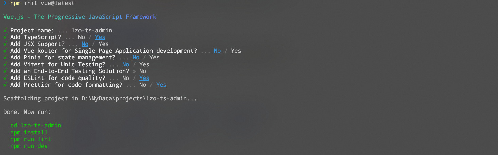

## 管理系统的定位核心

> 网上流行非官方词语**大前端**

1. 前端
2. 移动端IOS/android开发
3. 桌面端（electron 只要能跑node的平台都可以使用electron开发的桌面程序）
4. 其他平台(穿戴设备、车载系统)/VR/AR/.....
5. web3方向

> 都是与用户交互的过程中，产生各种各样的数据，都通过网络请求方式汇总到后端处理储存

> 有时这些数据需要人为的去控制管理，就需要通过**后台管理系统** 让管理员等不同权限的角色进行数据操作

> 总的来说后台管理系统就是**不同角色人群**对数据库数据的**增删改查的操作**、**数据报表统计展示**、**产品的配置操作**

## 项目创建于配置

### 创建项目

>   npm init vue@latest 内部使用 create-vue 创建vite版本脚手架

项目名称、TypeScript、JSX、路由、Pinia、单元测试、端对端测试、ESLint语法检测、Prettier格式化