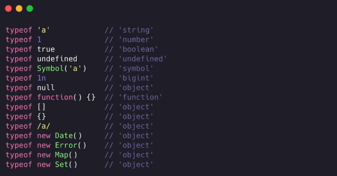
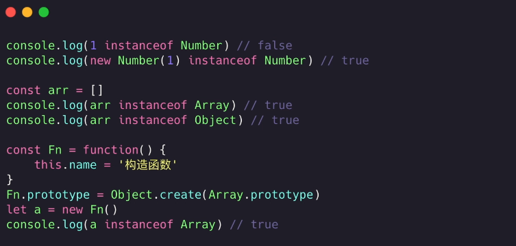
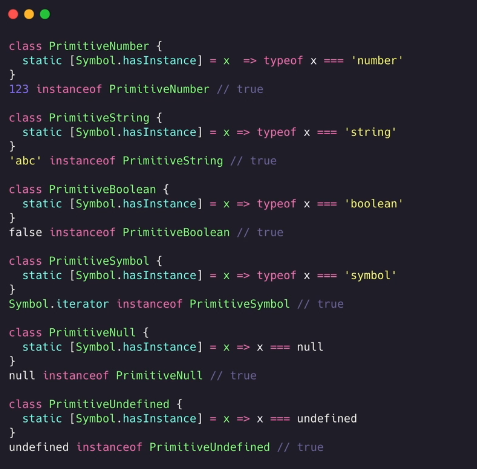
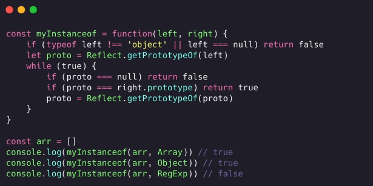
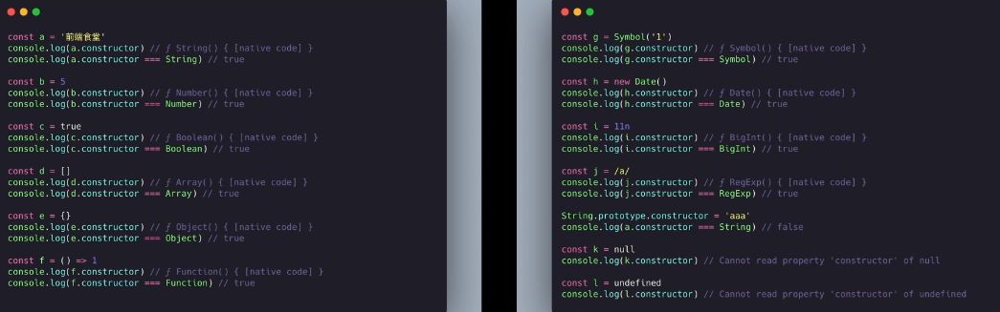
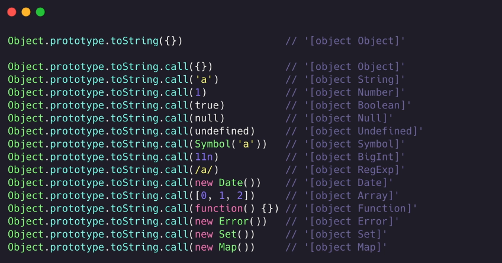
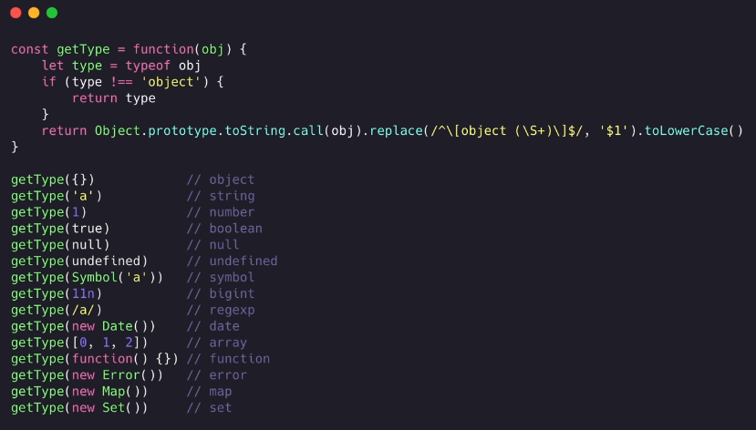
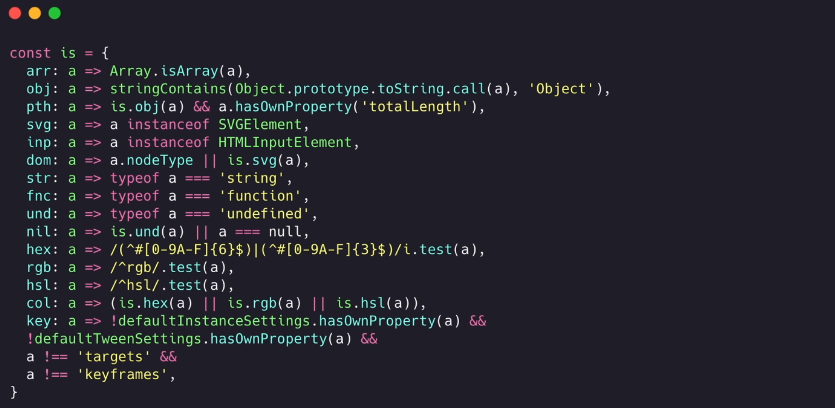

## JS 基础（ECMSscript）

### 概念

#### 认识 JavaScript

> -   JS 的作用是给浏览器*指令*，负责和浏览器进行*沟通*
> -   JS 是一门编程语言，与计算机交流的计算机语言
> -   JS 和 C、java、Python 等一样是高级语言
> -   JS 基于浏览器，一些内置方法源码需要找JS引擎
>     -   [ECMA](https://262.ecma-international.org/)

#### 编程语言的历史

-   阶段一:`机器语言`，由二进制 0101010 组成
-   阶段二:`汇编语言`，用符号来代替，010101 难以记忆的代码
-   阶段三:`高级语言`，接近自然语言，符合我们的思维方式,*JavaScript*算是一个

#### JavaScript 的历史

-   1995 浏览器两大厂商`网景公司`与`微软`
-   网景
    -   网景招募`Brendan Eich`,为了`前端表达验证`，10 写出了最开始的`LiveScript`(js)
    -   java 出来后很火爆，就把`LiveScript`改名`JavaScript`
-   微软
    -   微软开始用的是`JScript`
    -   所以为了适配需要两份代码
-   时间轴
    -   1996.11，网景公司向`ECMA（欧洲计算机制造商协会）`提交申请语言标准
    -   1997.06，ECMA 以 JavaScript 为基础指定了 ECMAScript 标准规范`ECMA-262`
        -   JavaScript 成为了 ECMAScript 标准规范最著名的实现语言之一
        -   然后 ActionScript 和 JScript 也是 ECMAScript 标准的实现语言

#### JavaScript 与 ECMAScript 标准的关系

-   ECMAScript 是 JavaScript 的标准，描述了该语言的`语法`与`基本对象`
-   JavaScript 是 ECMAScript 的实现之一，除了基本实现之外，JavaScript 还多了自己的`DOM，BOM`的操作

#### JavaScript 的特点

-   按照运行方式不同，
    -   `编译性语言`:C 语言/C++ --预编译-编译-汇编--> 等步骤`一次性`将代码转为(linux 或 window..的)二进制 --> 执行
    -   `解释性语言`:JS/Python --> 一行行读取，一行行执行(JS 浏览器执行)
    -   `先编译再解释`:java 编译成 .class
-   动静类型语言
    -   `静态类型`：在代码执行之前，可以确定一个变量准确类型，并且之后不予许修改
    -   `动态类型`：不确定一个变量的准确类型，可以动态改变变量类型，灵活，但是不安全(JS 就是这种)
-   js 的主要应用场景
    -   网页交互
    -   服务端开放(NodeJs)
    -   命令行工具(NodeJs)
    -   桌面应用程序(VsCode 用 TypeScript 开法，GitHub 可以验证)
    -   APP(React Native,uni 等)
    -   游戏开发(cocos2d-js)
    -   小程序开发

#### JavaScript 编写位置

-   在 HTML 中直接执行

```html
<div onclick="alert('html执行js')"></div>
<a href="javascript:alsert('html执行js')"></a>
```

-   通过 script 标签执行
-   通过 script src 属性外部引入 JS 文件
    -   标签间不能写代码，并且要有双标签
    -   由于文档是从上到下执行的，所以建议把标签放在主体内容后面
    -   早期需要`type="text/javascriopt"`这种,由于限制所以主流浏览器以及 html5 的默认脚本语言就是 JS,所以写 JS 代码的话不用写了
    -   html 和 css 不区分大小写，js`严格区分`

#### 注释

```javascript
1.js
// xxxxxx
/* xxxxxx */

文档注释格式
/**
 *  xxxxx
 *  xxxxx
 */


2.html
// <!---->

3.css
/**/


```

#### 有浏览器交互

-   cosole.log()
-   alert()
-   document.write()
-   prompt("请输入数据")

#### 如何定义变量

-   var 变量标识符 = 值;
-   var a,b,c;
-   let、const、var

-   标识符
    -   数字、字母、\_ 、$ (数字不能开头)
    -   不能是关键字和保留字(保留字很多是其他语言拥有，js 暂未实现的标识符)
-   命名规范以及主要事项

    -   小驼峰(多个单词，除第一个，后面的首字母大写)
    -   驼峰(多个单词首字母大写)
    -   见名知意
    -   复制等号两边建议加空格(shell 强制不能加空格)

-   交换两个值为数字的变量，不用第三个变量,可以用`加减`的方式实现

#### 数据类型

-   引用数据类型:Object
-   特殊的引用构造类型:Function、Array、Regexp、Date、Math、Error、Math、Map、Set
-   基础类型:Number、String、Boolean、Null、Undefined、Symbol、Bigint

    -   数字:Number,值数字、NaN
        -   Number.MAX_VALUE 最大数值
        -   Number.MIN_VALUE 最小数值
        -   NaN:not a number，错误的数值运算返回
        -   isNaN:判断是否不是一个数值
    -   字符串:String
        -   `转义字符`：\n、\r、\t、\b 分别代表换行、回车、制表、退格
            -   开始的打字机换行需要消耗 0.2 秒时间，可以打印两个字符，要是在这 0.2 秒里面，又有新的字符传过来，那么这个字符将丢失。
            -   在每行后面加两个表示结束的字符。一个叫做“回车”，告诉打字机把打印头定位在左边界；另一个叫做“换行”，告诉打字机把纸向下移一行
            -   所以一行结尾是“<回车><换行>”，即“\r\n”
    -   Boolean:true/false

    -   Undefined(未定义):只有一个值 undefined；
        -   变量声明未赋值
        -   函数为放回
        -   对象属性未添加,等情况产生
    -   Null(空):只有一个值 null
        -   将变量指向这个`null`,那么如何原来那个对象没有句柄的话，回收机制就会进行回收,`起到销毁对象的作用`
    -   Bigint：兼容性不好
        -   Number.MAX_SAFE_INTEGER 安全值之外的数运算可能失去精度 `9007199254740992 === 9007199254740993`
        -   创建BigInt数据，后面加n
            -   `9007199254740992n === 9007199254740993n`
            -   `BigInt(9007199254740992) === BigInt(9007199254740993)` ???
        -   注意点
            -   BigInt不支持一元加号运算符
            -   不允许在bigint和 Number 之间进行混合操作
            -   不能在JS内置函数中使用 `Math.max(2n, 4n, 6n);` xxx
            -   if中不是 `0n` 就是 true

-   数据类型转换
-   方法

    -   typeof 返回类型字符串
        -   typeof age // number
        -   typeof str // string

-   js 数据储存形式
    -   代码存储在硬盘，浏览器运行的时候会加载到`内存`
    -   内存空间
        -   栈空间(stack)
            -   申请变量空间=基础数据类型值
            -   申请变量空间=引用数据类型地址
        -   堆空间
            -   用用数据类型数据
        -   销毁
            -   变量=null
-   js 的二、八、十进制前缀
    -   0b、0o、0x

#### 检测数据类型

-   typeof
    -   检测 Array 等特殊构造类型都为`object`
        
    -   可以判断处理 null 外的原始数据类型
        -   可能是 js 最初的 bug，为了兼容老代码一直保留
    -   只能判断对象类型中 Function
    -   除此之外 typeof NaN 为 number
-   instanceof
    -   检测某个构造行数的 prototype 属性是否出现在某个实例的原型链上(检测一个对象是否是某个构造函数的实例对象)
        
    -   由于可以随意更该原型指向，所以这个不安全
    -   可以准确判断引用对象类型，不好判断原始类型
        -   Symbol.hasInstance 用于判断某对象是否为某构造器的实例。拿来自定义 instanceof 操作符在某个类上的行为。
            
    -   实现 instanceof
        
-   constructor
    

    -   返回构造函数
    -   数值字面量如 1.constructor 直接使用会报错，需要通过(1).constructor 用()将数值转对象
    -   处理 null 和 undefined，其他都比较可以检测
    -   constructor 也可以手动修改，不安全

-   Object.prototype.toString.call()
    
    -   返回一个表示该对象的字符串
    -   封装
        
        

#### 数据类型转换

-   转数值类型
    -   Number(a);
        -   数字字符串(正常),不是正常数字(NaN)
        -   true/false => 1/0
        -   undefined/null => NaN/0
    -   parseInt(str,radix 进制)/parseFloat(str) ,合理运用编辑器代码提示
        -   将字符串转整型/浮点型，只能是字符串
        -   字符串有其他字符，取前面的数字(Number 直接 NaN)，第一个不是数字返回 NaN
-   转字符串
    -   num.toString()
        -   null、undefined、无 toString()
    -   String(num)
        -   null、undefined、布尔、数字等都可以
    -   num + "":与字符串拼接
-   转 bool(分支语句隐式调用 Boolean)
    -   Boolean(num)
        false:""、0、-0、undefined、null、NaN
        true:其他转字符串都为 true

#### 运算符

-   算术运算符
    -   (加 正 字符串拼接)+、-、\*、/、%、++、--
    -   自增自减++在前先加再用，++在后，先用再加
-   赋值运算符
    -   =、+=、-=、\*=、\=、%=
-   逻辑运算符
    -   &&、||、！
    -   断路运算-常用
-   比较运算符
    -   ==、!=、>=、<=、<、\> (== 的类型自动转换一般先转 number，再进行比较)
    -   ===、!== (严格相等比较，不会对比较的数据类型进行隐式转换,既比较类型也比较数据)
-   优先级
    -   `()` > `++|--` > `*|/|%` > `位运算符的左右移` > `非等判断` > `等全等不等` ....
    -   `,` < `赋值` < `?:三元运算` < 逻辑|| < 逻辑&& < 非左右移按位....

### 执行语句

> 顺序(默认从上往下)、分支、循环的常用执行顺序
> 用{}包裹的代码，叫做`代码块`

#### 分支

-   `if else`
-   `switch`:switch(exp){case "常量 1":语句 1;break;.....;default:语句 n;}

#### 循环

-   `for`
-   `while(exp){}`:条件为真一直循环执行
-   `do...while`
-   `break，continue`：break 跳出整个循环(这个 for 或整个 while)，continue 跳出本次循环

### 数组

### 字符串

### 重要概念

`事件循环 EventLoop`、


## JS API

> 通过 JS 操作 html(DOM) 和 浏览器(BOM)

### DOM

> dom 文档对象模型，操作网页内容，实现特效和交互

-   DOM 树对象(浏览器根据html标签生成的JS对象)

    -   DOM 树对象包含所有标签
    -   修改某个对象属性会映射到所有标签上

    ```javascript
    // querySelector(css选择器 button | .class | #id | ul li...); 返回第一个匹配的对象，没有返回null
    // querySelectorAll 返回所有匹配 NodeList 伪数组(有长度、有索引、但是没有js pop push 等方法)
    let div = document.querySelector("div")
    
    // 修改内容
    document.write("xxx"); // 直接追加到文档
    div.innerHTML = "xxx"; // 设置元素内容
    div.outerHTML = ""; // 包括操作元素与元素内容
    div.innerText = 'xxx'; // 不识别标签
    div.title='xxx'; // 修改属性
    div.style.background="#f0f"; //修改样式
    div.style.backgroundColor="#f0f"; // 驼峰换横杆
    // div.style.width 这种只能操作行内的样式 
    
    div.className='addClass'; //动态添加类 覆盖原有类名
    div.className+=" newclassName"; // 不会被覆盖
    
    div.classList // 获取样式列表 
    div.classList.add("xxx"); // 添加
    div.classList.remove("xxx"); // 删除
    div.classList.toggle("xxx"); // 切换
    
    // ========================================元素大小和位置 (三大家族 scroll offset client)
    // scroll
    div.scrollWidth // 返回div内容的宽高(内部超过自己元素,或文本的宽高，div overflow:auto; 后拉动滚动条后可以看到的宽高)
    div.scrollHeight 
    div.scrollTop  // 向上滚动了的，看不见的大小，默认0，可赋值修改
    div.scrollLeft // 向右   最大的scrollLeft值 + 可见有内容的宽度 = div.scrollWidth
    document.documentElement.scrollTop //整个文档滚动了的距离
    
    // offset
    div.offsetWidth  // 元素自己的宽高(包括 内容+填充+边框 和 滚动条)
    div.offsetHeight 
    div.offsetTop // 获取自己上面，距离最近一个有定位父级的高度， 都没有就以浏览器左上角为准
    div.offsetLeft
    // 当document.xxx.scrollTop == 某个元素的 offsetTop 时，就是这个元素到顶的时候
    // 与 window.outerWidth 类似
    
    // client
    div.clientWidth // 获取元素可见部分宽高(包括 padding-left + height + padding-right)
    div.clientHeight
    div.clientTop  // 返回的是元素上左边框的厚度（border）,无边框为0
    div.clientLeft
    // 与 window.innerWidth 类似
    
    // 表单操作
    let btn = document.querySelector("button");
    btn.disabled = false; //禁用按钮
    
    ```

-   节点(DOM树每个DOM下的属性内容等都是节点)

    -   元素节点、属性节点、文本节点、空格换行...

    ```javascript
    // 元素节点(DOM树的每一个标签)操作
    // 获取父节点
    eleNode.parentNode
    
    // 获取子节点
    eleNodeParent.children
    
    // 兄弟节点
    eleNode.nextElementSibling  //下一个节点
    eleNode.previousElementSibling // 上一个节点
    
    // 创建元素节点
    let div = document.createElement("div");
    div.className="xxx";
    
    eleNodeParent.appendChild(div) // 父元素最后最近新节点
    eleNodeParent.insertBefore(div,parentDom) //指定节点前插入  参数:新节点， 指定放在哪个节点前面
    
    // 克隆节点
    eleNode.cloneNodew(true)  // 可溶一个一样的节点，参数true代表连后代节点一起克隆
    
    // 删除节点
    eleNodeParent.removeChild(eleNodeParent.children[0]) //必先找到父节点，从父节点删除子节点
    ```


    ```

-   事件

    -   事件监听(绑定事件、注册事件)，监测程序是否有注册的事件发生，如果有就立即调用一个函数做出响应

    ```javascript
    // DOMLevel 0
    // 相同事件会被覆盖，都是事件冒泡
    // <input type="button" onclick="alert(0);" />
    ele.onclick = function(){}
    ele.onclick = null; // 清理
    
    // DOMLevel 2
    // 相同事件不会被覆盖，可设置捕获和冒泡
    // 事件源 ele 、事件名 args[0] 、事件触发做的事情 args[1]
    ele.addEventListener("event name",()=>{},bool); //bool 代表是否使用捕获机制，true 捕获 false 冒泡
    ele.removeEventListenet("event name","函数名称",bool) // 清除事件，匿名函数无法被清除
    // DOMLevel 3 一样的只是加了很多很多事件
    
    // 创建自定义事件（新）
    const event = new Event('build');
    // 添加 e 的属性
    const event = new CustomEvent('build', { detail: elem.dataset.time });
    // 监听它
    elem.addEventListener('build', (e) => { /* … */ }, false);
    // 触发它
    elem.dispatchEvent(event);
    
    ```

    -   事件对象

    ```javascript
    /**
     * 监听函数回调的第一个参数 e event ...
     * 包含与事件相关信息的对象
     * 常用属性 e. (不同事件 e的属性不一样)
     *      type：当前事件类型
     *      clientX/clientY：点击位置相对于浏览器可见窗口左上角的位置（显示位置不包括状态栏等）      
     *      pageX/pageY：点击位置相对于document文档左上角的位置(包括页面滚动的距离)      
     *      offsetX/offsetY：点击位置相对于当前点击的DOM元素左上角的位置      
     *      screenX/screenY：点击位置相对于设备屏幕的位置      
     *      layerX/layerY：点击位置，冒泡方向，有position定位元素，定位元素的 offsetX/offsetY 值,否则 == pageX/pageY
     *      movementX/movementY：鼠标移动的时候，这次相对上次移动的距离（移动慢基本是 0 1 -1 -2）
     *      tiltX/tiltY：指针（触控笔）的 XZ 平面与屏幕之间的角度,正值 向用户倾斜，不支持位0      
     *
     *      key/code：获取检测操作的按键的值(以前的keyCode ascii码 废弃中)      
     *      
     *      
     */ 
    
    ```

    -   事件流

    ```javascript
    /**
     * 事件流指的是事件完整执行过程中的流动路径
     * 主要有两个阶段 事件捕获 和 事件冒泡 
     * 事件捕获 (参数三设置true)
     *    一个元 素事件被触发，先触发最父层，拥有该事件的元素
     *    document 开始 -> html -> body -> 单前点击的元素      
     * 事件冒泡
     *    当一个元素事件被触发时，同样的事件会在该元素的祖先元素(父级、父父级。。document)依次触发，如果它们有监听这个事件的话
     *    当前点击元素  -> body -> html -> document  
     *
     * 阻止事件流动 （事件冒泡，事件捕获）
     *    监听注册事件的时候，冒到这个元素的这个事件就会停止
     *    e.stopPropagation();
     *
     * 鼠标移入依次事件
     *      mouseover 和 mouseout  这个移入移出默认有冒泡行为
     *      mouseenter 和 mouseleave  这个移入移出不会有冒泡行为
     *
     * 阻止默认行为（阻止链接跳转，表单的默认就要的功能）
     *      e.preventDefault()
     *
     * 事件流特性 实现事件委托
     *      给父级注册事件，父级收到点击的时候，通过 e.target 获取具体点击的子元素
     *
     *
     */
    ```

    -   常用事件

    ```javascript
    // 滚动事件 scroll
    window 或 ele.addEventListener("scroll",(e)=>{
        
    })
    
    // load 和 DOMContentLoaded (document 的 dom被解析后就直接触发 无需等待样式表、图片等加载完成)
    // pageshow 事件在每次加载页面时触发，即 onload 事件在页面从浏览器缓存中读取时不触发。 
    // resize 当窗口发生变化时触发
    // contextmenu 右键触发
    // hashchange 该事件在当前 URL 的锚部分发生修改时触发
    // pagehide 该事件在用户离开当前网页跳转到另外一个页面时触发
    ```

-   环境对象 this

    -   非箭头函数 谁调用this指向谁

    ```javascript
    // this 指向
    function fn(){
        console.log(this);
    }
    
    fn() == window.fn() == window;
    
    let obj = {
        fn:function(){
            console.log(this)
        }
    }
    obj.fn() == obj
    
    // ele 被点击 this 是ele 
    ele.addEventListener("click",function(){
        console.log(this)
    })
    
    // 面向对象
    function Obje(){
        console.log(this,'default') // Obje {}
        this.showthis = function(){
            console.log(this,'showthis') // Obje {}
        }
    }
    Obje.prototype.showprotothis = function(){
        console.log(this,'showprotothis') // Obje {}
    }
    let sobj = new Obje();
    
    // call
    function testCall(){
        console.log(this)  // Obje {}
    }
    testCall.call(Obje)
    
    ```

### BOM 

> 浏览器对象模型 ,最顶级 window 对象

window 常见方法

```javascript
// window 的方法 都可以省略 window.
// setInterval alter addEventListener requestAnimationFrame 全局函数...

// 定时器
window.setInterval
window.clearInterval
window.setTimeout
window.clearTimeout
window.requestAnimationFrame // 也是一个时间内调用此次回调函数，只是它的时间是系统决定的，不是用户决定的

/**
 * 本地存储
 * 将数据存储在浏览器中，刷新或关闭浏览器都可以保留数据
 *
 * localStorage 5M 左右
 *      生命周期永久存在，除非手动删除，或 或特殊浏览器(chromeium 就没办法保留)
 *      相同浏览器 相同站点多页面共享
 *      键值对方式储存
 */

 localStorage.setItem(key,value) // 添加普通数据
 localStorage.setItem(key,JSON.stringify(Obj)) // 添加对象数据
 localStorage.getItem(key) // 获取普通数据
 JSON.parse(localStorage.setItem(key)) // 获取对象数据
 localStorage.removeItem(key) // 删除


// sessionStorage  临时储存，关闭浏览器数据消失
```

window 主要包含模块

-   document (网页文档)
    -   JS 执行机制
    -   `document.execCommand('copy')` 复制文档中选中的内容
    -   `document.activeElement` 获取操作页面上聚焦的元素，默认body
    -   `document.designMode=on` 设置文档可编辑 ，设置为设计模式，所有功能失效
-   location 对象
    -   URL相关的操作
    -   location.reload(true) 刷新页面，true == Ctrl + F5
-   navigator 对象
    -   浏览器相关信息
    -   navigator.clipboard 替代即将废弃的 `document.execCommand`
-   history 对象
    -   浏览器的前进/后退/上个页面 forward() 、back() 、go(-1)
-   screen

```javascript
// 设备显示屏的宽高
screen.width
screen.height

// 浏览器最大化后的宽高 与 距离上左的距离
screen.availWidth
screen.availHeight
screen.availTop
screen.availLeft

screen.availHeight + screen.availTop == screen.height

```

-   其他 window 属性

```javascript
screenLeft/screenX // 窗口距离设备左边的距离
screenTop/screenY // 窗口距离设备上边的距离

```


## JS 高级

>   项目实践 `lzo-web-project` 下 `ECMAScript` 下的 **JS高级**

[ecma 标准](https://www.ecma-international.org/publications-and-standards/standards/)

### JavaScript 的 this

```javascript
// 四种影响this的因素
function fn(){ console.log(this) }
// 默认绑定 window 为 this，直接调用
fn()

// 隐式绑定，调用对象obj 为 this，通过对象调用
obj.fn()

// 显示绑定 call/apply/bind 强制绑定目标
fn.call({},'a','b')
fn.apply({},['a','b'])

let fnb = fn.bind({},'a','b') // 得到一个新的，绑定好指定this指向的函数
fnb('a','b') // this指向 {}

// new 绑定,构造函数的this指向new时创建的空对象
let nfn = new fn()

// 箭头函数无this，只会使用上级作用域的this，call/apply/bind 对它无效，隐式绑定对它也无效
```

### 浏览器的运行原理

#### 通过URL拿到资源

```shell
# 1、输入网站
# 2、解析域名（DNS解析） 得到域名对应主机的IP地址
# 3、连接主机，通过用户访问的端口、路径返回对应资源到浏览器
# 4、浏览器得到返回的页面(index.html)
# 6、运行index.html  => 遇到link下载css => 遇到script下载js并执行（阻塞无法构建DOM tree） => 遇到图片下载 ...
```

#### 浏览内核

>   常见的**浏览器内核**/**浏览器引擎**/**渲染引擎**


#### 页面渲染详细流程

```shell
# 浏览器拿到index.html
# 遇到引入css，下载css，解析css ，不阻塞继续解析html，形成 DOM tree (之后JS可能进行DOM操作)
# 解析CSS，形成 CSSOM Tree(CSS 对象模型 Style Rules) 
# 合并 DOM tree 和 Style Rules，生成渲染树 Render Tree
# 在 Render Tree 上进行 Layout 布局（确定宽高和位置信息）
# 		当页面DOM位置变化，宽高方式变化也会重新 布局 Render Tree (称为 回流)
# 进行 Painting 绘制 （样式发生变化 会来到 Painting 进行 重绘）
# 进行 Display 显示
```


>   引起回流的场景（reflow）

```shell
# DOM 结构发生改变，添加移除移动节点
# 部分发生改变（widht height padding font-size 等）
# 窗口 resize 等
# ...
```

>   重绘 （repaint）

```shell
# 第一次渲染内容叫绘制（paint）
# 之后，页面颜色所有颜色发生改变，边框样式发生改变就会发生重绘
```

>   回流一定包含重绘，重绘不一定包含回流，避免回流方法

```shell
# 修改样式时尽量已持续修改，（通过class修改，好了一次性添加到dom上）
# 避免评分操作DOM（用 DocumentFragment 一次性操作）
# 对一些元素使用绝对定位，时回流的范围减小（脱离文档流）
```

####  特殊解析 composite 合成

>   浏览器渲染的优化手段

默认情况，前面是一个**标准流**的**渲染流程**，标准流的内容会被绘制在**一个图层(Layer)**中 （控制台找到更多工具 找到 layers 可查看）

特殊属性（如：定位）会创建一个**新的单独的合成层**（`CompositingLayer`），并且新的图层可以利用**GPU来加速绘制**

-   每个合成层都是单独渲染的，不会影响标准流
    -   3D transforms，
    -   transition过度过程中，如果元素用 transform 做动画，会形成新图层，提高效率
    -   video、canvas、iframe 
    -   position：fixed ( 形成一个新的Layer ，absolute 只会脱标，不会新城合成层) 
    -   给元素添加属性 will-change ，那么这个元素产生动画，也会分层
-   新图层提高性能是需要 **消耗硬件资源**的，所有不能滥用 

 #### Script 元素的优化

>   因为 JS 需要经常操作 DOM ，防止过度重绘回流，渲染时遇到 JS 默认会先执行完成再继续，所以JS放前面会阻塞页面渲染

`script` 属性 `defer` 和 `async`

#####  defer 属性

>   当浏览器遇到defer 属性的 **script 文件**，会先对立下载页面，等待DOM Tree 构建完成，再执行script

```javascript
<head>
    <script src="./js/test.js" defer></script>
	<script src="./js/demo.js" defer></script>    
</head>
<body>
    <div id="app">app</div>
    <div class="box"></div>
    <div id="title">title</div>
    <div id="nav">nav</div>
    <div id="product">product</div>

    <!-- 1.下载需要很长的事件, 并且执行也需要很长的时间 -->
    <!-- 总结一: 加上defer之后, js文件的下载和执行, 不会影响后面的DOM Tree的构建 -->
    <!-- 总结二: 如果脚本提前下载好了，也会等待DOM Tree 构建完毕，在DOMContentLoaded 事件之前先执行defer中的代码 -->
    <script>
        // 总结三: defer代码是在DOMContentLoaded事件发出之前执行
        window.addEventListener("DOMContentLoaded", () => {
        console.log("success");
    });
    </script>

    <h1>哈哈哈哈啊</h1>
</body>

// 如果多个defer的script文件，浏览器会保证安装编写的顺序依次执行
// 执行书序  直接下载两个js文件/同时展示页面，包括 最后的h1 => DOM Tree 构建完成 => 依次执行外部脚本 => 打印 success
```

##### async 属性

>   让脚本不阻塞页面，让脚本完全独立，独立下载、独立运行、不会等待其他脚本、不能保证在 DOM Tree 构建后执行

### JS 引擎

>   前面只提到下载执行阻塞 JavaScript 代码，没有说的**具体执行过程**

浏览器内核（webkit）由 `WebCore` 和 `JavaScriptCore (JSCore JS引擎)` 两部分组成


#### V8引擎执行原理

-   [V8 引擎](https://v8.dev)是**blink**浏览器内核的**内置 JS引擎** 
-   Google 开源，C++ 编写，主要用于`Chrome` 和 `Node.js`
-   V8 引擎可以**独立运行**，也可以其他任何程C++序中 

-   V8 的工作流程


将后 **js 源码**通过 **Parse** 解析成 **AST抽象语法树**，通过 **lgnition** 转化为cpu认识的**字节码bytecode** 给cpu运行

#### V8核心概念

##### Parse 解析模块

>   将 JavaScript 执行到的代码转化成 **AST 抽象语法树**，**lgnition** 解释器并不认识js源码
>
>   词法分析(Scanner) => 分词记号化(大量 tokens)  => 一部分直接解析(parser) / 一部分进行与解析(pre-parser)  => 得到一个个Node节点 => 得到 AST抽象语法树

##### lgnition 解释器

>   将 `AST` 转换成 `bytecode` 字节码
>
>   同时收集**TurboFan优化**所需要的信息，函数只调用一次，直接解释和执行 `bytecode`
>
>   函数调用多次，会别标记为**热点函数**，下次就会直接通过 `TurboFan` 转换成**优化**的**机器码**，**提高**执行性能

##### TurboFan 编译器

>   可以将收集到的（标记为热点函数的）字节码直接编译为 CPU 直接执行的**机器码**
>
>   后续**热点函数**执行的**参数等因素**发生变化，**机器码**会被还原成 **字节码**，**降低**执行性能

##### 垃圾回收模块

。。。

### 浏览器中 JS 的运行原理

 #### 初始化全局对象

-   js 引擎在执行代码**之前**，会在**堆内存中**创建一个**全局对象**：`Global Object(Go)`
-   GO对象 所有**作用域（scopt）**都可以访问
-   里面包含 `Date`、`Array`、`String`、`Number`、`Math`、`setTimeout`、`setInterval` 这些全局函数
-   还有一个**window 属性**指向自己

#### 执行上下文栈（ECS）

>   就是执行代码的调用栈 （Execution Context Stack ECS），代码都是要在执行上下文栈中执行的

##### 执行上下文

-   接下来开始执行**全局代码**

    -   需要构建一个 **全局执行上下文**`Global Execution Context（GEC）` 来执行**js引擎翻译好的** -**全局代码**

    -   **全局执行上下文** 会**最先**放入到 **执行上下文栈**中，处于最底部

    -   调用函数，或es6的代码块，这些**活跃的，局部的，执行执行上下文**，依次压入，叠加，就形成了**栈结构**，先进后出
        -   函数执行上下文（FEC）
    -   最上面的永远是正则被执行的 **执行上下文**，执行完成，从**栈顶出栈**

##### 执行上下文的 VO 详解

>   每个执行上下文，都有一个自己**保存变量的地方**，让用户获取使用

-   **js 引擎翻译解析**代码，**开始执行前**，**变量**放到内存中的**执行上下文**的细节
    -   每一个**执行上下**文会关联一个**VO ( Variable Object 变量对象 ) **，用来存放**变量和函数**声明
        -   代码永远是在执行上下文执行的，基本类型数据也是存在**栈内存**中，只是在 VO 对象属性中**额外保存**相应变量值
    -   **全局执行上下文**的 **VO** 就是 堆内存**GO** 就是 **window  对象 **
        -   每次函数**调用**，创建新的 **FEC**，创建AO关联，函数执行上下文的 VO 是堆内存的**AO (Activation Object 活跃的)**
        -   初始化 argument，将**参数作为变量存入AO中**
        -   这个 AO 会作为函数执行上下文的 VO  来初始化变量
        -   函数执行完毕，该函数的 FEC 出栈，AO 对象失去了句柄，在堆内存中游离，等待回收机制处理 
    -   var变量放到执行上下文，默认值是 undefined
    -   函数提前 放到执行上下文，默认值是一个内存地址，指向创建好的函数位置（所以函数可以在定义位置之前执行）
        -   只有最外层，能碰到的函数会预先创建

##### 执行上下文的作用域链

>   涉及变量的查找，就会用到 作用域  （scope）

每一个**执行上下文**自己关联变量的 VO对象

>   作用域链 （scope chain） 

-   行数**创建的时候**，就已经**确定了自己的作用域链**，与定义位置有关，与执行位置无关
    -   通过debugger ，sources，找到 witch，添加监视的函数名，找到 `[[Scopes]]` 
    -   浏览器有优化，如果没有使用某个上层作用域的变量，这边是看不到的
-   每创建一个函数执行上下文，都会拿到函数定义就确定的**作用域链**（`scope chain`）
    -   作用域链是一个存放VO的列表（定义位置上下文的VO ~ 全局上下文的VO），根据**代码类型**初始化一系类数据
    -    当使用一个变量标识符时，现在自己的作用域查找，找不到，才会去作用域链依次查找

##### 闭包

>   作用域链的特性，作用域链与**定义位置**有关，是形成闭包的最大因素

-   闭包实际上是一个 **函数和一个关联的环境** 组成的 **结构体**
-   跟函数的最大差别是，当捕捉闭包的时候，他的 **自由变量** 会在**捕捉时被确定**，这样既**脱离了原先的上下文**，也能**照常运行**
-   每创建一个函数时，闭包就被创建了

-   js 中一个普通函数 function，如果他可以访问外层作用域的自由变量，那么这个函数的周围环境就是一个闭包
    -   广义上说：JavaScript 中的函数都是闭包
    -   狭义上说：JavaScript 中的函数，如果**访问了外层作用域的变量**，那么就是一个闭包

>   闭包的运用

-   运用案例一：默认情况，函数中通过参数，直接使用外部变量
-   运用案例二：定义**外层函数**内部**定义并返回新函数**，我们拿到**内层函数** 对**外层函数参数或变量**的**任意使用**的过程 
    -   返回就是为了把内部函数地址储存到外面去，否则是没办法使用的，也是一个无用的闭包
    -   地址存到变量，比如全局 **addr**，就会存到 GO，根据**可达性**，GO 可以从addr找到**返回的函数**，**返回的函数**使用了外部函数变量，外部函数的AO，就可以从[[Scoops]]找到**外部函数的AO**，那么程序没结束，内部函数，和外部函数的AO对象就不会销毁
    -   多次调用外层函数获得内存函数，会产生保留**多个不同的AO**，所有它们不冲突 
-   运用案例三：**柯里化函数**

>   内存泄漏 

以上面**案例二**为例，我们得到了内部函数地址，储存到**全局的addr中**，关联这这个**addr和它作用域链的AO对象**

如果后期永远不用这个**addr**，而**垃圾回收GC**根据可达性，不知道我们不用，不进行回收，这种情况就是**内存泄漏**

可以通过 **addr = null** 手动释放

**addr** 关联的这个**闭包**里面用很多OA对象数据 ，如果不手动释放，就对内存很有压力，所以**说闭包容易尝试内存泄漏**

普通表达式函数，


##### 执行上下文的 This

#### 内存管理与垃圾回收

>   不管怎么方式管理内存，都会有几个生命周期

-   申请需要的内存
-   使用分配的内存
-   不需要时，释放内存空间
    -   手动管理：C、C++ 需要手动管理内存，通过调用API申请释放内存
    -   自动管理：Java、JavaScript、Python 等都会自动管理内存

##### js的垃圾回收

>   JavaScript 的垃圾回收机制 （Garbage Collection）GC

 对于**不再使用的对象**，我们都称之为**垃圾**，它需要被**回收**，以释放更多的内存空间

>    常见的GC算法

1、V8 使用标记清除算法（mark-Sweep）

-   核心思路**可达性（Reachability）**
-   首先需要一个**根对象**，回收器会**定期从根对象开始**，找所有**能引用到的对象**进行**标记**，那些**没有引用到**的对象，就是**不可用**的
-   js 中根对象就是 GO window
-   怎么找才是难的

 V8 对标记清除算法的一些优化

-   标记整理
    -   如果清除了13579位置的内存空间，下次需要一个较大的空间，这些位置**还是不能用**
    -   **标记整理**会将，保留的02468位置，**搬运汇集**到**连续的内存**中，避免**碎片化**
-   分代收集
    -   将新创建的对象放一起，老旧放一起，新的多检查，老的稳定可以减少检测频次
-   增量收集
-   闲时收集


2、引用计数，遛狗法则（Reference counting），js不用这个

实时计算有**多少个东西**在引用某个**空间的对象**，多一个+1，少一个-1，引用某个对象的**引用数量为0**，就能销毁

### JavaScript 函数增强

#### 函数对象的属性

>   传统行数创建就存在的属性 

name
length（定义时明确形参的个数，不包括剩余参数 ）
argument （类数组对象，类数组转数组的多种方式 ，箭头函数自己无 argument ）

>   剩余参数

形参中将不确定的参数放进一个数组中 

**rest** 剩余参数与**argument**不同的是，它是一个**真正的数组**

```javascript
function arg(a,b,...argsxxx){
    console.log(argsxxx) // [3,4,5]
}
arg(1,2,3,4,5)
```

 #### 纯函数

-   此函数**相同的输入**，必须有**相同的输出**（就是平时用的工具函数）
-   此函数执行过程中，不能有**副作用**
    -   副作用：执行函数时，除了产生返回值外，还对外面数据产生了附加影响（如修改了全局变量，修改了其他状态等）

#### 柯里化 （Currying）

>   闭包的一种使用场景，

 只传递**一部分参数**来调用某个函数，让它返回一个函数去处理剩余参数，这个**过程就叫柯里化**

柯里化**只是对函数的一种转化**，（意义在于前面括号可以提取共有部分，在这个基础上设置其他变化的东西）

```javascript
// 1.没有柯里化的时候做法
function logInfo(date, type, message) {
    console.log(`时间:${date} 类型:${type} 内容:${message}`);
}

logInfo("2022-06-01", "DEBUG", "修复了从服务器请求数据后展示的bug")
logInfo("2022-06-01", "DEBUG", "修复了从服务器请求数据后展示的bug")
logInfo("2022-06-01", "FEATURE", "新建过滤功能")
logInfo("2022-06-01", "FEATURE", "新建过滤功能 ")
        
// 2.对函数进行柯里化: 柯里化函数的做法 =========================================
function logInfo(date) {
    return function (type) {
        return function (message) {
            console.log(
                `时间:${date} 类型:${type} 内容:${message}`
            );
        };
    };
}
logInfo("2022-06-01")("DEFAULT")("这时一个默认日志");
var logToday = logInfo("2022-06-01"); // 固定第个参数

// 打印debug日志
var logTodayDebug = logToday("DEBUG"); // 设置类型为 DEBUG
logTodayDebug("修复界面搜索按钮点击的bug");
logTodayDebug("修复界面搜索按钮点击的bug");

var logTodayFeature = logToday("FEATURE"); // 设置类型为 FEATURE
logTodayFeature("新建过滤功能");
logTodayFeature("新建搜索功能");
```

#### 额外知识（少用）

##### with

>   强行插入作用域，不推荐使用

 ```javascript
 var obj = {
     message: "Hello World",
 };
 
 with (obj) {
     console.log(message);
 }
 ```

##### eval

>   允许执行代码字符串，将传入的函数当做js代码运行，并将最后一句执行语句结果作为返回值

```javascript
var codeString = `var name = "why"; console.log(name); console.log(message); "abc";`;
var result = eval(codeString);
console.log(result);
```

##### 严格模式

JS 早期设计存在一些缺陷，浏览器更加**严格的检测代码**，通过**抛出错误**消除原因的**静默错误**

-   无法意外创建全局变量
-   不允许使用 with
-   不允许视图删除不可删除的对象属性
-   在严格模式下, this不绑定全局对象而是undefined
-   ......

```javascript
// 给整个script开启严格模式
"use strict";

// 给一个函数开启严格模式
function foo() {
    "use strict";
}

// 默认就是严格模式
class Person {}
```


### JavaScript 对象增强

#### 数据属性描述符

限制一个属性能做什么不能做什么

```javascript
var obj = {
    name: "why", // configurable: true
    age: 18,
};

// 给 obj 对象的 name 属性添加 数据描述符 
Object.defineProperty(obj, "name", {
    configurable: false, // 告诉js引擎, obj对象的name属性不可以被删除
    enumerable: false, // 告诉js引擎, obj对象的name属性不可枚举(for in/Object.keys ,遍历的时候不显示)
    writable: false, // 告诉js引擎, obj对象的name属性不写入(只读属性 readonly)
    value: "coderwhy", // 告诉js引擎, 返回这个value
});

// 通过Object.defineProperty方式添加的属性，configurable 默认 true
Object.defineProperty(obj, "address", {});
```

#### 存取属性描述符

存取属性描述符，通过**两个函数**精准控制**存的过程**和**取的过程**

```javascript
/**
 *  vue2响应式原理 （响应式就是监听到变化，更新视图）
 *  通过 oninput 事件监听数据变化
 *  当数据发生变化，触发属性的 set，在 set 中将视图中的 {{xxx}} 替换为 最新值
 */
var obj = {
    name: "why",
};

// 对obj对象中的name添加描述符(存取属性描述符)
var _name = "";
Object.defineProperty(obj, "name", {
    configurable: true,
    enumerable: false,
    set: function (value) {  // 当属性name被赋值了，我们可以做一些事情
        console.log("set方法被调用了", value);
        _name = value;
    },
    get: function () { // 当属性name被查询了，我们可以做一些事情
        console.log("get方法被调用了");
        return _name;
    },
});
```

### 面向对象

#### 原型

>   每一个对象都有原型 [[Prototype]]

```javascript
var obj = {
    name: "why",
    age: 18,
};

// 查看对象的原型
console.log(obj.__proto__); // 浏览器实现的，非标准
console.log(Object.getPrototypeOf(obj)); 
```


#### 原型链


 


